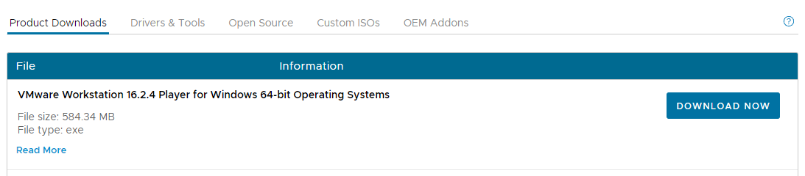
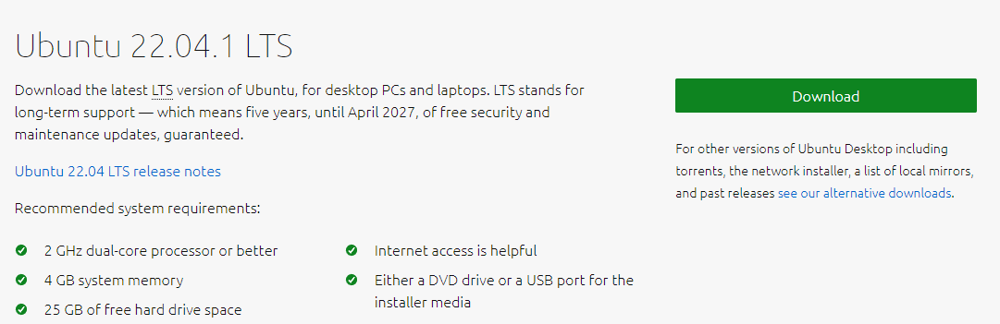

# Hadoop 설치

> 프로젝트에 진행하기에 앞서 분산처리의 가장 기초 기술인 Hadoop 설치를 시작으로 사용하는 방법에 대해 기술해보려고 한다!

<br>


### 1. Vm ware 설치



- [Vmware Workstation Player](https://customerconnect.vmware.com/en/downloads/info/slug/desktop_end_user_computing/vmware_workstation_player/16_0) 에서 최신버전 설치파일 다운받은 후 실행

<br>

### 2. Ubuntu 설치



- [Ubuntu Download](https://ubuntu.com/download/desktop)에서 LTS 버전을 다운 받자!

<br>

### 3. VMware Workstation에서 Ubuntu 설치

- [VM ware에서 ubuntu 설치](https://velog.io/@717lumos/VMware-%EA%B0%80%EC%83%81%EB%A8%B8%EC%8B%A0-VMware%EC%97%90-Ubuntu-%EC%84%A4%EC%B9%98%ED%95%98%EA%B8%B0) <- 이분꺼를 보면서 필요한 언어팩 같은 거 설치!

- ctrl + alt + t : 터미널 실행

<br>

### 4. Hadoop 설치

- 작업할 경로에 스켈레톤 프로젝트 다운 받고 Project 폴더 확인

- 설치

  ```bash
  $ sudo chown -R hadoop:hadoop Project
  $ cd Project
  $ sudo mv hadoop-3.2.2/usr/local/hadoop
  $ sudo apt update
  $ sudo apt install ssh openjdk-8-jdk ant -y
  $ ./set_hadoop_env.sh
  $ source ~/ .bashrc
  ```

  
