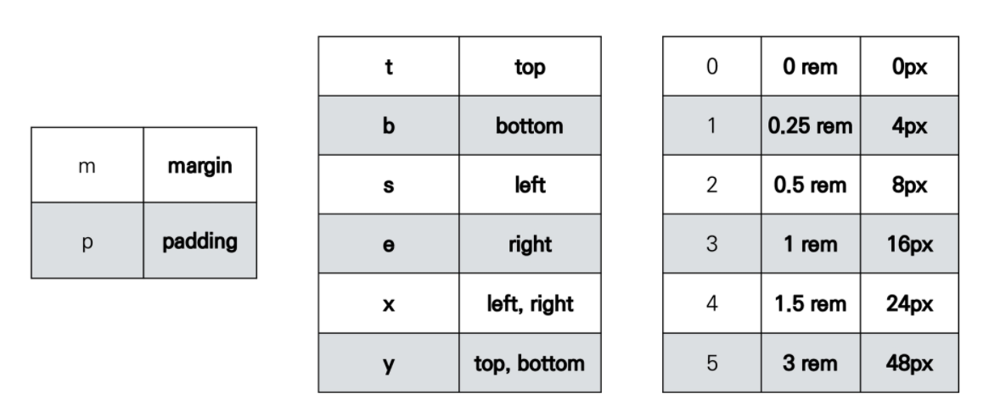
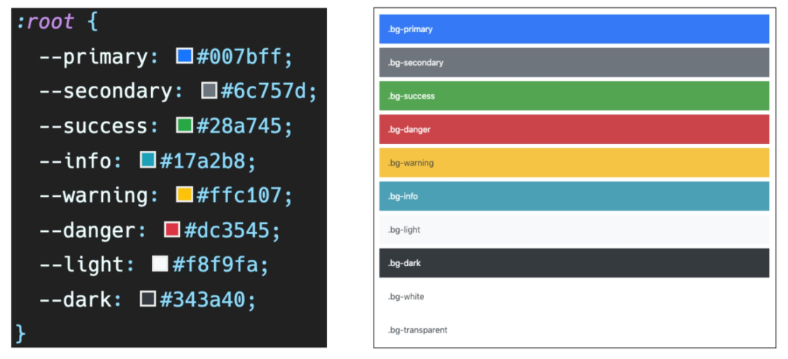
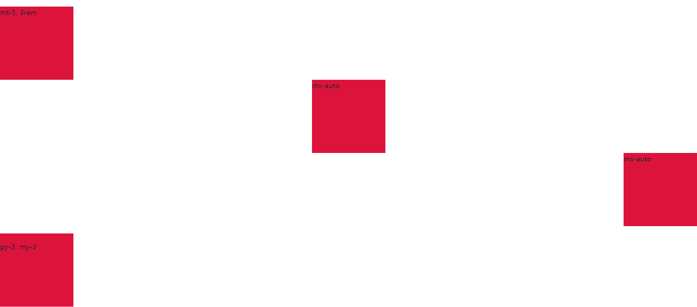
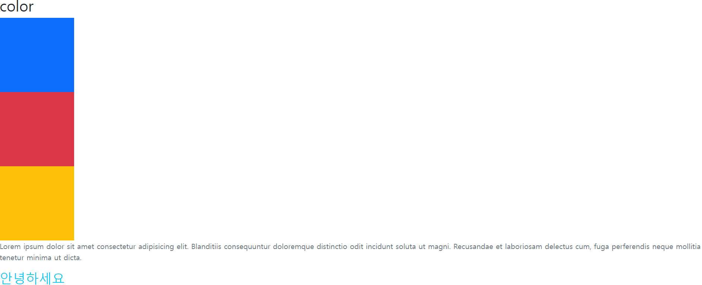
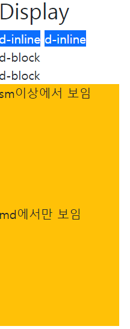
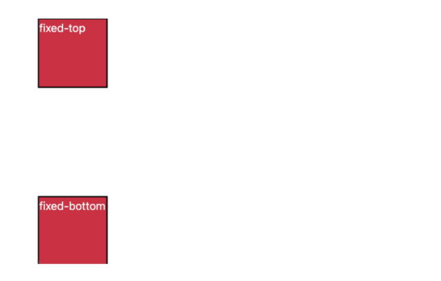

# 🌱 Bootstrap

- [항상 참고 해야하는 사이트](https://getbootstrap.com/docs/5.1/utilities/spacing/#margin-and-padding)
- 일반적인 부스트트랩 사용할 때 링크와 스크립트에 각각 `css` 파일과 `js` 파일을 삽입해야 한다.

```html
<!DOCTYPE html>
<html lang="en">
<head>
  <meta charset="UTF-8">
  <meta http-equiv="X-UA-Compatible" content="IE=edge">
  <meta name="viewport" content="width=device-width, initial-scale=1.0">
  <link rel="stylesheet" href="bootstrap.css">
  <title>Document</title>
</head>
<body>
  <h1>부스트트랩!</h1>
    
    <script src="bootstrap.bundle.js"></script>
    # 일반적으로 스크립트는 바디 태그 닫기전에 입력해준다. 
</body>
</html>
```

- 위의 사용법은 직접 `css` 파일과 `js` 파일을 다운로드 받고 같은 경로 안에 있어야 한다.

- 더 간단하게 사용하는 방법으로 `CDN`이 있다.
- Content Delivery(Distribution) Network
- 컨텐츠(CSS, JS, Image, Text 등)을 효율적으로 전달하기 위해 여러 노드에 가진 네트워크에 데이터를 제공하는 시스템.
- 개별 end-uesr의 가까운 서버를 통해 빠르게 전달 가능(지리적 이점)
- 외부 서버를 활용함으로써 본인 서버의 부하가 적어짐

```html
    <link href="https://cdn.jsdelivr.net/npm/bootstrap@5.1.3/dist/css/bootstrap.min.css" rel="stylesheet" integrity="sha384-1BmE4kWBq78iYhFldvKuhfTAU6auU8tT94WrHftjDbrCEXSU1oBoqyl2QvZ6jIW3" crossorigin="anonymous">
</head>
<body>
  <nav class="navbar navbar-expand-lg navbar-dark bg-dark">

  <script src="https://cdn.jsdelivr.net/npm/bootstrap@5.1.3/dist/js/bootstrap.bundle.min.js" integrity="sha384-ka7Sk0Gln4gmtz2MlQnikT1wXgYsOg+OMhuP+IlRH9sENBO0LRn5q+8nbTov4+1p" crossorigin="anonymous"></script>
</body>
```

## spacing



#### .mt-1

```css
부트스트랩은 mt-1을 아래와 같이 선언했다.
.mt-1 {
    margin-top: 0.25rem !important;
}

16 * 0.25 = 4px
브라우저 <html>의 root 글꼴 크기는 16px
```

| class name | rem     | px   |
| ---------- | ------- | ---- |
| m-1        | 0.25rem | 4    |
| m-2        | 0.5rem  | 8    |
| m-3        | 1rem    | 16   |
| m-4        | 1.5rem  | 24   |
| m-5        | 3rem    | 48   |

#### .mx-0

```css
.mx-0 {
    margin-right: 0 !important;
    margin-left: 0 !important
}
```

#### .mx-auto

```css
.mx-auto {
    margin-right: auto !important;
    margin-left: auto !important;
}

# 수평 중앙 정렬
```

#### .py-0

```css
.py-0 {
    padding-top : 0 !important;
    padding-bottom: 0 !important;
}
```


## color




## 실습 해보기

### Spacing

```html
<h1>bootstrap 기초 활용</h1>
<h2>spacing</h2>

# .mt - 5 {
	margin-top: 3rem !important;
} 
<div class="box mt-5">mt-5, 3rem</div>

# .mx-auto {
	margin-right: auto !important;
	margin-left: auto !important;
}
<div class="box mx-auto">mx-auto</div>

# .ms-auto {
	margin-left: auto !important;
}
<div class="box ms-auto">ms-auto</div>

# .py-3 {
	padding-top: 1rem !important;
	padding-bottom: 1rem !important;
} 
  .my-3 {
	margin-top: 1rem !important;
	margin-bottom: 1rem !important;
}
<div class="box py-3 my-3">py-3, my-3</div>
```



### Color

```html
<h2>color</h2>
<div class="bg-primary"></div>
<div class="bg-danger"></div>
<div class="bg-warning"></div>
<p class="text-secondary">Lorem ipsum dolor sit amet consectetur adipisicing elit. Blanditiis consequuntur doloremque distinctio odit incidunt soluta ut magni. Recusandae et laboriosam delectus cum, fuga perferendis neque mollitia tenetur minima ut dicta.</p>
<h3 class="text-info">안녕하세요</h3>
```



### Display

```html
<h2>Display</h2>
<div class="d-inline text-white bg-primary">d-inline</div>
<div class="d-inline text-white bg-primary">d-inline</div>
<span class="d-block">d-block</span>
<span class="d-block">d-block</span>

<div class="d-none d-sm-block bg-warning">sm이상에서 보임</div>
<div class="d-none d-md-block d-lg-none bg-warning">md에서만 보임</div>
```



- 특정 디바이스의 가로 폭 크기에 대해 해당 클래스가 포함된 태그를 가리거나 보이도록 하는 방법
- d-none, d-block과 같이 사용되며 특정 디바이스 크기에 대해 두 클래스를 조합해서 사용해야 한다.

| Hidden on all                              | `.d-none`                         |
| ------------------------------------------ | --------------------------------- |
| Hidden only on all (모든 화면에서 숨기기)  | `.d-none`                         |
| Hidden only on xs (xs 크기에서만 숨기기)   | `.d-none .d-sm-block`             |
| Hidden only on sm (sm 크기에서만 숨기기)   | `.d-sm-none .d-md-block`          |
| Hidden only on md (md 크기에서만 숨기기)   | `.d-md-none .d-lg-block`          |
| Hidden only on lg (lg 크기에서만 숨기기)   | `.d-lg-none .d-xl-block`          |
| Hidden only on xl (xl 크기에서만 숨기기)   | `.d-xl-none .d-xxl-block`         |
| Hidden only on xxl (xxl 크기에서만 숨기기) | `.d-xxl-none`                     |
| Visible on all (모든 화면에서 보이기)      | `.d-block`                        |
| Visible only on xs (xs 크기에서만 보이기)  | `.d-block .d-sm-none`             |
| Visible only on sm (sm 크기에서만 보이기)  | `.d-none .d-sm-block .d-md-none`  |
| Visible only on md (md 크기에서만 보이기)  | `.d-none .d-md-block .d-lg-none`  |
| Visible only on lg (lg 크기에서만 보이기)  | `.d-none .d-lg-block .d-xl-none`  |
| Visible only on xl (xl 크기에서만 보이기)  | `.d-none .d-lx-block .d-xxl-none` |

### Position

```html
<h2>Position</h2>
<div class="position-container position-relative bg-warning">
    <div class="position-absolute top-0 start-0 bg-primary"></div>
    <div class="position-absolute bottom-0 end-0 bg-info"></div>
</div>
```


```html
<h2>
    <div class="box fixed-top">fixed-top</div>
    <div class="box fixed-bottom">fixed-bottom</div>
</h2>
```


