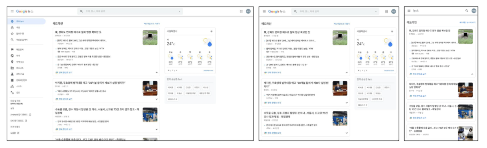
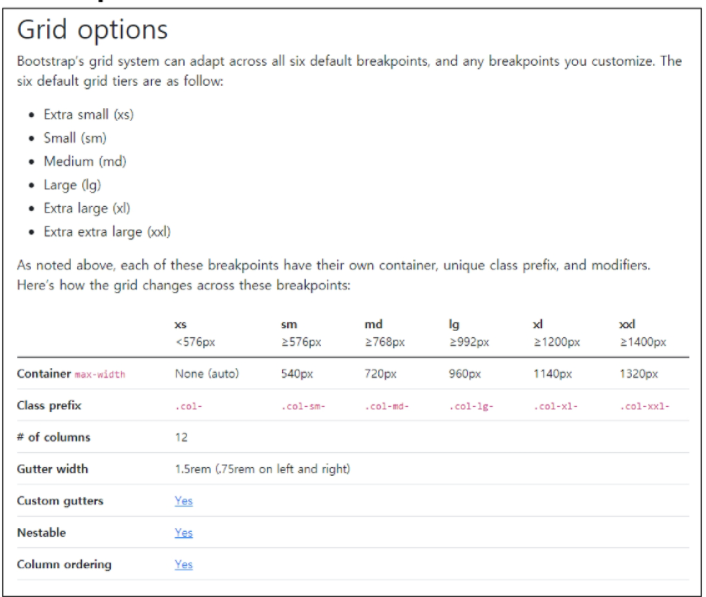
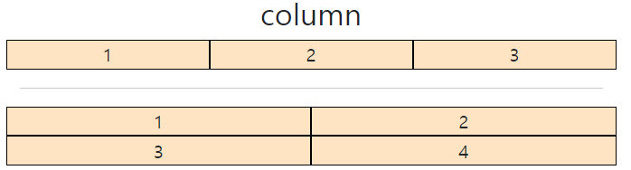
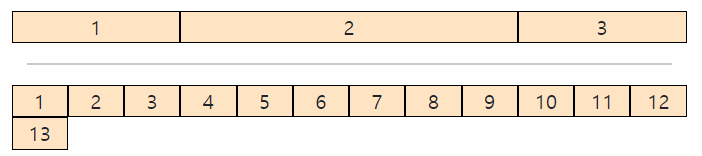
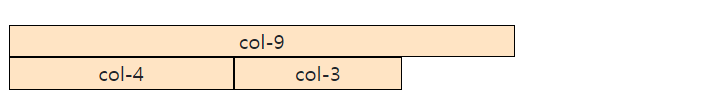
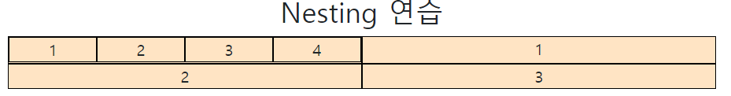
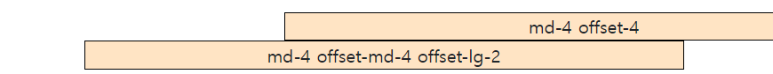

# 🌱 Bootstrap - Grid System

## Responsive Web Design

- 다양한 화면 크기를 가진 디바이스들이 등장함에 따라 responsive web design 개념이 등장
- 반응형 웹은 별도의 기술 이름이 아닌 웹 디자인에 대한 접근 방식, 반응형 레이아웃 작성에 도움이 되는 사례들의 모음 등을 기술하는데 사용되는 용어
- Media Queries, Flexbox, Bootstrap Grid System, The viewport meta tag



**<span style=color:indianred>같은 컨텐츠를 보는 각기 다른 디바이스의 화면에 맞추어 보이도록 하는 것!</span>**

## Grid system (web design)

- 요소들의 디자인과 배치에 도움을 주는 시스템
- 기본요소
  - Column : 실제 컨텐츠를 포함하는 부분 (12개)
  - Gutter : 컬럼과 컬럼 사이의 공간 (사이 간격)
  - Container : Column들을 담고 있는 공간 

## Bootstrap grid system

- bootstrap grid system은 flexbox로 제작됨
- container, rows, column으로 컨텐츠를 배치하고 정렬
- 반드시 기억해야할 2가지!
  1. **12개의 column**
  2. **6개의 grid breakpoints**

### 기본적인 사용법

```html
<div class="container">
    <div class="row">
        <div class="col">col</div>
        <div class="col">col</div>
        <div class="col">col</div>
    </div>
</div>
```

### Grid system breakpoints



### Grid system breakpoints 연습1

```html
<div class="container">
    <h2 class="text-center">column</h2>
    <div class="row">
        <div class="box col">1</div>
        <div class="box col">2</div>
        <div class="box col">3</div>
    </div>
    <hr>
  
    <div class="row">
      <div class="box col">1</div>
      <div class="box col">2</div>
      
      # 새로운 class "w-100"(width 100%)을 해주면서 줄바꿈을 할 수 있다. 
      <div class="w-100"></div>
      
      <div class="box col">3</div>
      <div class="box col">4</div>
    </div>
  </div>
```



### Grid system breakpoints 연습2

```html
<div class="container">
    <div class="row">
      <div class="box col-3">1</div>
      <div class="box col-6">2</div>
      <div class="box col-3">3</div>
  </div>
  <hr>
  
    <div class="row">
      <div class="box col-1">1</div>
      <div class="box col-1">2</div>
      <div class="box col-1">3</div>
      <div class="box col-1">4</div>
      <div class="box col-1">5</div>
      <div class="box col-1">6</div>
      <div class="box col-1">7</div>
      <div class="box col-1">8</div>
      <div class="box col-1">9</div>
      <div class="box col-1">10</div>
      <div class="box col-1">11</div>
      <div class="box col-1">12</div>
      <div class="box col-1">13</div>
    </div>
  </div>
```



### Grid system breakpoints 연습3

```html
<div class="container">
	<div class="row">
    	<div class="box col-9">col-9</div>
        <div class="box col-4">col-4</div>
        <div class="box col-3">col-3</div>
</div>
```




### 반응형 연습

```html
# breakpoint에 맞게 col을 바꿈
<div class="container">
    <h2 class="text-center">반응형 연습</h2>
    <div class="row">
        <div class="box col-2 col-sm-8 col-md-4 col-lg-5">576px 미만 2, 576 이상 8, 768 이상 4, 992 이상 5</div>
        <div class="box col-8 col-sm-2 col-md-4 col-lg-2">576px 미만 8, 576 이상 2, 768 이상 4, 992 이상 2</div>
        <div class="box col-2 col-sm-2 col-md-4 col-lg-5">576px 미만 2, 576 이상 2, 768 이상 4, 992 이상 5</div>
    </div>
```


### Nesting

```html
# col을 할당한 요소 하위에 row를 만들고 col을 각각 할당함 
<div class="container">
    <h2 class="text-center">Nesting 연습</h2>
    <div class="row">
      <div class="box col-6">
        <div class="row">
          # 4등분
          <div class="box col-3">1</div>
          <div class="box col-3">2</div>
          <div class="box col-3">3</div>
          <div class="box col-3">4</div>
        </div>
      </div>
      <div class="box col-6">1</div>
      <div class="box col-6">2</div>
      <div class="box col-6">3</div>
```



### Offset

- offset 선택자를 추가하면 왼쪽으로부터 크기만큼 떨어져서 배치된다.
- 어떤 요소를 중앙 정렬하거나 오른쪽 정렬할 때 유용하다.

```html
<div class="container">
    <div class="row">
      <div class="box col-md-4 offset-4">md-4 offset-4</div>
      <div class="box col-md-4 offset-md-4 offset-lg-2">md-4 offset-md-4 offset-lg-2</div>
    </div>
  </div>
```

- md 보다 작을 때



- md 이상일 때


- lg 이상일 때


