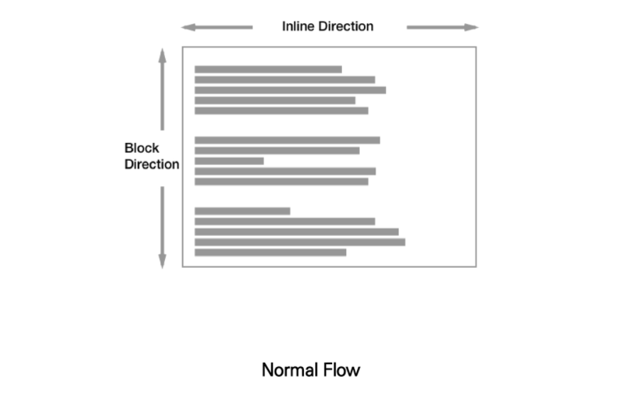
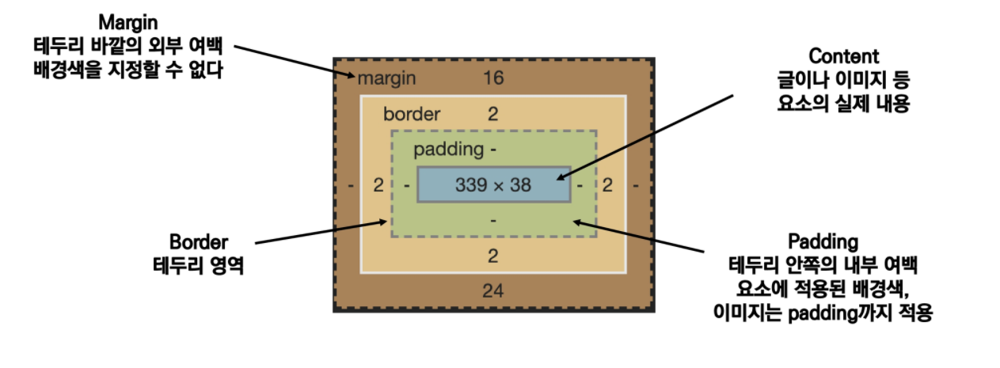
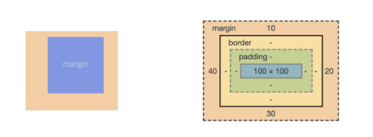
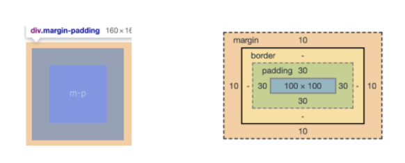
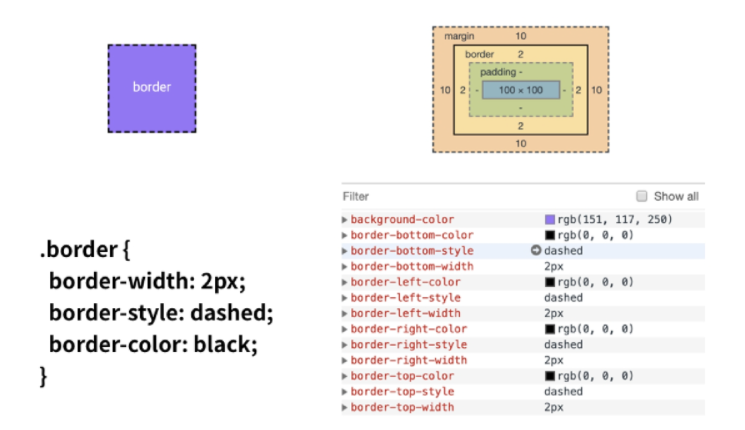
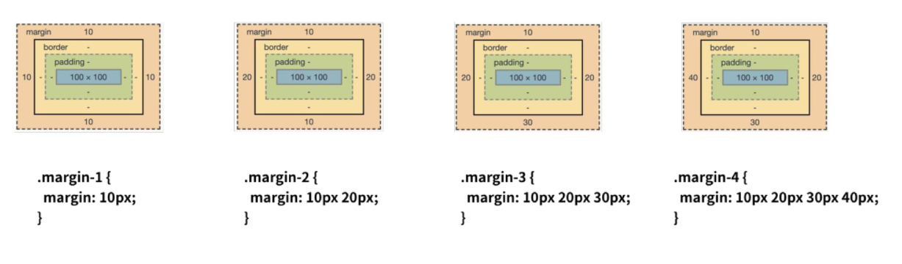
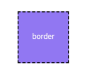
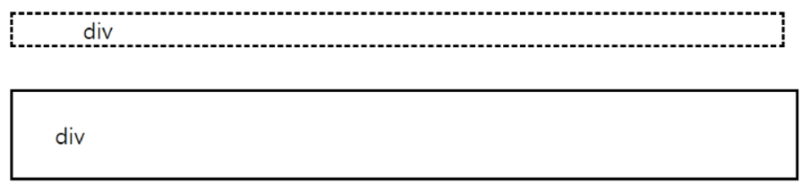
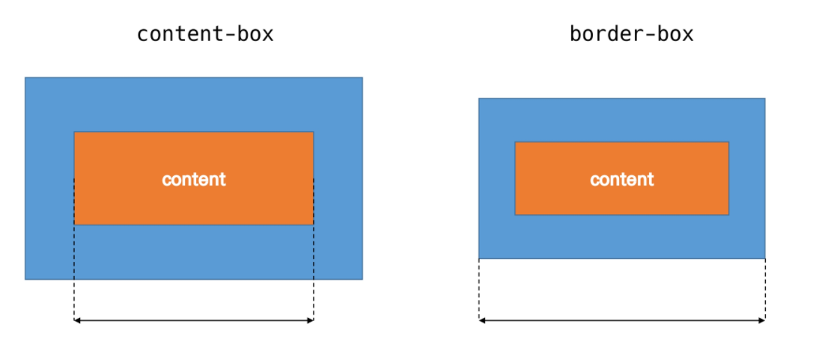

# 🌱 CSS - Box model

**모든 요소는 네모(박스 모델)이고, 위에서부터 아래로, 왼쪽에서 오른쪽으로 쌓인다. (좌측 상단에 배치)**



- 모든 HTML 요소는 box 형태로 되어 있음

- box model 구성요소 - 하나의 박스는 4가지 영역으로 이루어져 있음

  - contents
  - padding
  - border
  - margin

  

### margin

```css
.margin{
    margin-top: 10px;
    margin-right: 20px;
    margin-bottom: 30px;
    margin-left: 40px;
}
상 - 우 - 하 -좌
```




### padding

```css
.margin-padding{
    margin: 10px;
    padding: 30px;
}
```



### border

```css
.border{
    border-width: 2px;
    border-style: dashed;
    border-color: black;
}
```



### shorthand를 통해서 표현

- margin/padding



- border

```css
.border{
    border: 2px dashed black;
}
```



### box 만들어 보기(1)

```html
#html
<body>
    <div class="box1">div</div>
    <div class="box2">div</div>
</body>
```

```css
#css
<style>
.box1{
    width: 500px;
    border-width: 2px;
    border-style: dashed;
    border-color: black;
    padding-left: 50px;
    margin-bottom: 30px;
}

.box2{
    width: 500px;
    border: 2px solid black;
    padding: 20px 30px;
}
</style>
```



### box 만들어 보기(2)

```html
#html
<body>
    <div class="box">content-box</div>
    <div class="box box-sizing">border-box</div>
</body>
```

```css
#css
<style>
.box{
    width: 100px;
    margin: 10px auto;
    padding: 20px;
    border: 1px solid black;
    color: white;
    text-align: center;
    background-color: blueviolet;
}

.box-sizing{
    box-sizing: border-box;
    margin-top: 50px;
}
</style>
```

- box 클래스에 적용하는 css를 보면 margin 에서 `auto`라는 것이 있는데, 저 코드를 해석 하면, **위 아래 여백을 10px 정도 주고 좌 우는 `auto`, 즉 양쪽 동일하게 여백을 맞춰준다는 의미이다.** 결과적으로 사이트 중앙에 위치하는 것을 볼 수 있다. 
- box-sizing은 박스의 크기를 어떤 것을 기준으로 계산할지를 정하는 속성으로 기본값은 `content-box`이다.
  - content-box : 컨텐츠 영역을 기준으로 크기를 정함
  - border-box : 테두리를 기준으로 크기 정함
  - initial : 기본값으로 설정
  - inherit : 부모 요소의 속성 값을 상속 받음
- box의 `width`를 100으로 주었지만, `box-sizing` 속성의 값을 다르게 주면 박스의 크기가 달라진다.
  - content-box값을 주면 컨텐츠 영역의 너비가 100px이고 테두리를 포함한 너비는 142px이다.
  - border-box 값을 주면, 테두리를 포함한 너비가 100px이고 켄텐츠 영역의 너비는 58이다. 


### content-box와 border-box 차이



- 기본적으로 모든 요소의 box-sizing은 content-box
  - Padding을 제외한 순수 contents 영역만을 box로 지정
- 다만, 우리가 일반적으로 영역을 볼 때 border까지의 너비를 100px로 보는 것을 원함
  - 그 경우 box-sizing을 border-box로 설정 