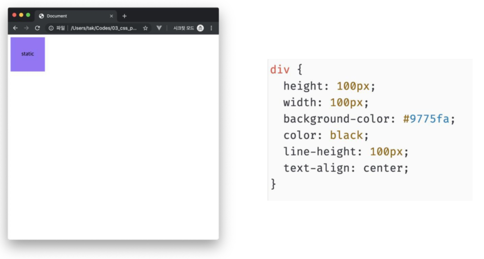
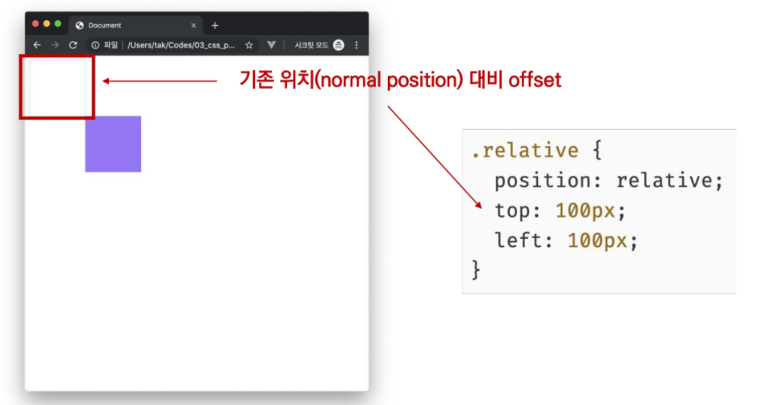
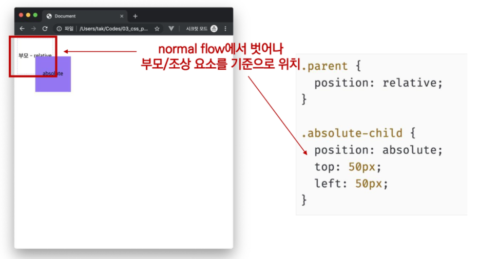
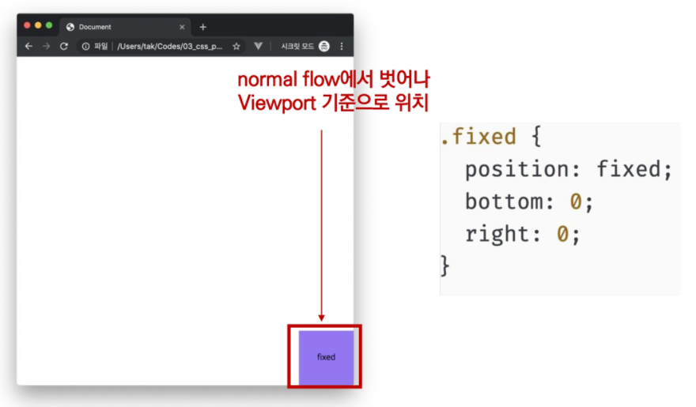
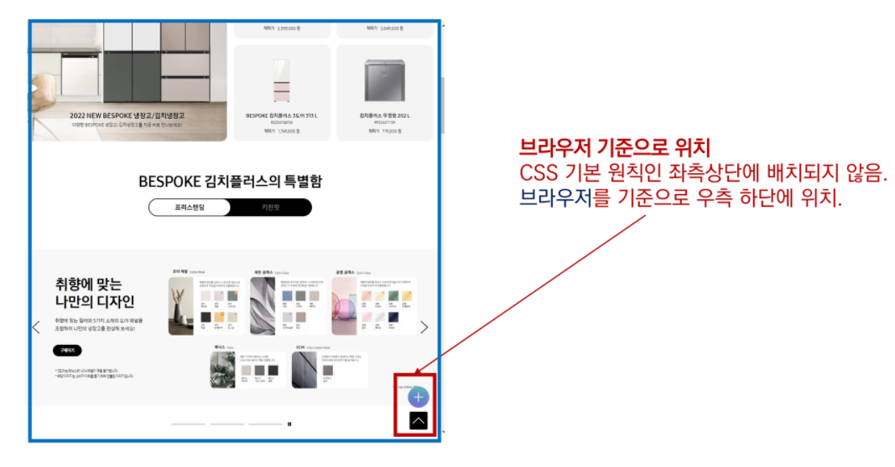

# 🌱 CSS - Position

- 문서 상에서 요소의 위치를 지정
- static: 모든 태그의 기본값 (기준 위치)
  - 일반적인 요소의 배치 순서에 따름 (좌측 상단)
  - 부모 요소 내에서 배치될 때는 부모 요소의 위치를 기준으로 배치 됨
- 아래는 좌표 프로퍼티(top, bottom, left, right)를 사용하여 이동 가능
  - relative
  - absolute
  - fixed

#### static

### relative : 상대 위치

- 자기 자신의 static 위치를 기준으로 이동 (**normal flow 유지**)
- 레이아웃에서 요소가 차지하는 공간은 static 일 때와 같음 (normal position 대비 offset)
- 쉽게 말해 실제 공간은 static 위치에 있지만 화면상에서 옮겨진 위치로 보이도록 하는 것

#### relative

### absolute : 절대 위치

- 요소를 일반적인 문서 흐름에서 제거 후 레이아웃에 공간을 차지하지 않음 (**normal flow에서 벗어남**)
- static이 아닌 가장 가까이 있는 부모/조상 요소를 기준으로 이동 (없는 경우 body)

#### absolute

### fixed : 고정 위치

- 요소를 일반적인 문서 흐름에서 제거 후 레이아웃에 공간을 차지하지 않음 (**normal flow에서 벗어남**)
- 부모 요소와 관계없이 viewpot를 기준으로 이동
  - 스크롤 시에도 항상 같은 곳에 위치함

#### fixed

- fixed 예시

## 참고하기 좋은 사이트

- MDN web docs
  - https://developer.mozilla.org/ko/
- 개발자 도구 활용법
  - https://developer.chrome.com/docs/devtools/css/