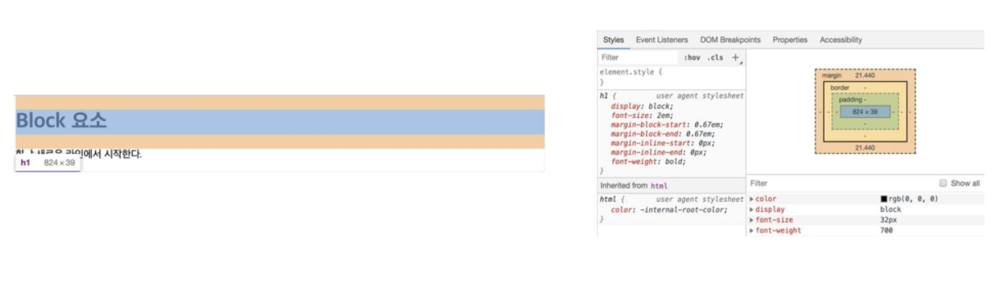
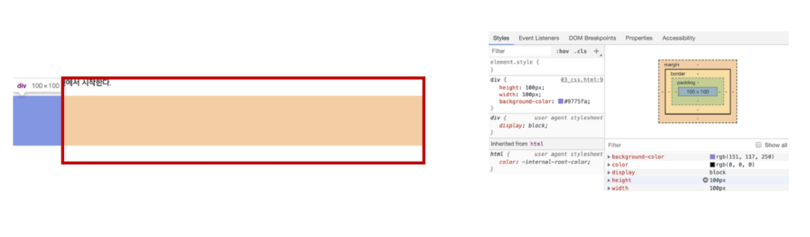
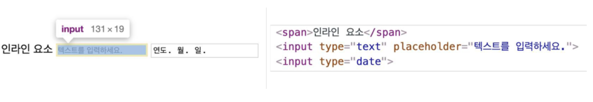
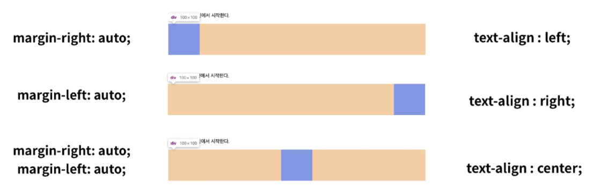
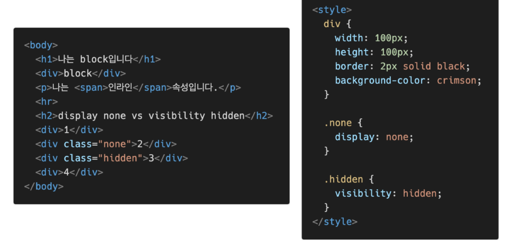
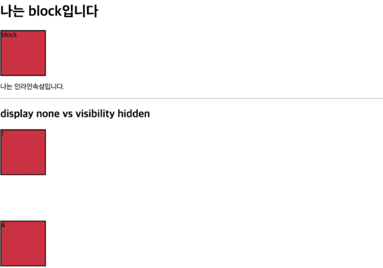

# 🌱 CSS - Display

**모든 요소는 네모(박스 모델)이고, 좌측 상단에 배치, display에 따라 크기와 배치가 달라진다.**

### display: **block**

- 줄 바꿈이 일어나는 요소
- 화면 크기 전체의 가로 폭을 차지한다.
- 블록 레벨 요소 안에 인라인 레벨 요소가 들어갈 수 있음.
- div / ul, ol, li / p / hr / form 등

> block의 기본 너비는 가질 수 있는 너비의 100%
>
> 

> 너비를 가질 수 없다면 자동으로 margin이 부여된다.
>
> 
>
> 

### display: **inline**

- 줄 바꿈이 일어나지 않는 행의 일부 요소
- content 너비만큼 가로 폭을 차지한다. 
- width, height, margin-top, margin-bottom을 지정할 수 없다.
- **상하 여백은 line-height로 지정한다.** 
- span / a / img / input, label / b, em, i, strong 등

> inline의 기본 너비는 컨텐츠 영역만큼
>
> 
>
> 

### 속성에 따른 수평 정렬

### display: inline-block

- block과 inline 레벨 요소의 특징을 모두 가짐
- inline처럼 한 줄에 표시 가능하고,  block처럼 width, height, margin 속성을 모두 지정할 수 있음

### display: none

- 해당 요소를 화면에 표시하지 않고, 공간조차 부여되지 않음
- 이와 비슷한 visibiliy: hidden은 해당 요소가 공간은 차지하나 화면에 표시만 하지 않는다.

이외 다양한 display 속성 👉 [모질라](https://developer.mozilla.org/ko/docs/Web/CSS/display)

### 확인해보기

- html, css 파일

- 화면

