# 🌱 CSS - Layout

## Float

- 박스를 왼쪽 혹은 오른쪽으로 이동시켜 텍스트를 포함 인라인 요소들이 주변을 wrapping 하도록 함
- 요소가 Normal flow를 벗어나도록 함

### Float 속성

- none : 기본값
- left : 요소를 왼쪽으로 띄움
- right : 요소를 오른쪽으로 띄움

#### 예시 1

```html
# html
<body>
    <div class="box left">float left</div>
    <p>lorem300 자동 완성으로 길~게</p>    
</body>
```

```css
# css
.box{
    width: 150px;
    height: 150px;
    border: 1px solid black;
    background-color: crimson;
    color: white;
    margin-right: 30px;
}

.left{
    float: left;
}
```

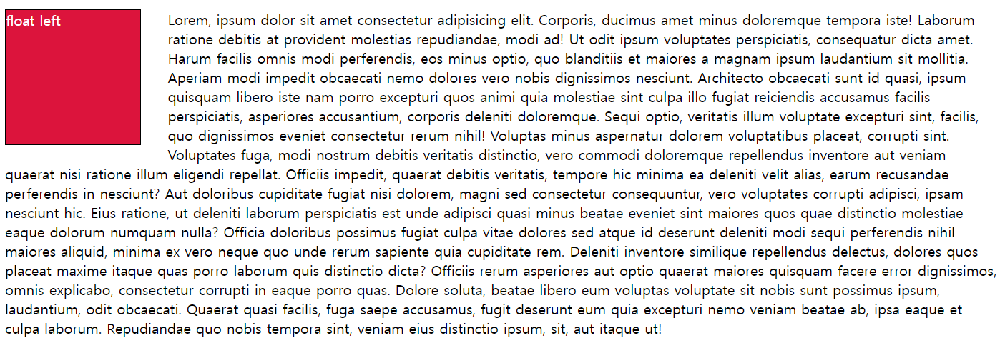

#### 예시 2

``` html
# html
<body>
    <header>
        <div class="box1">div</div>
    </header>
    <div class="box2">div</div>
</body>
```

```css
# css
.box1{
    width: 150px;
    height: 150px;
    border: 1px solid black;
    background-color: crimson;
    color: white;
    text-aligin: center;
    line-height: 150px;
}

.box2{
    width: 300px;
    height: 150px;
    border: 1px solid black;
    background-color: blue;
    color: white;
    text-align: center;
    line-height: 150px;
}

```

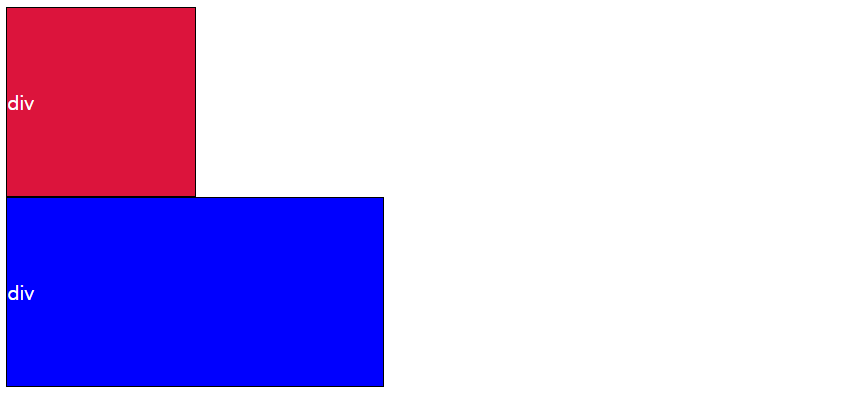

- 여기서  첫번째 빨간 박스에 float를 주면 빨간 박스가 위로 떠버려서 파란박스랑 겹쳐진 형태로 보이게 된다. 

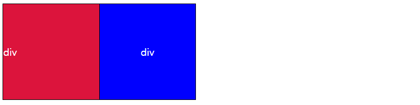

- 빨간색 박스의 내부 요소가 Float 상태로 높이가 지정되지 않아서 생기는 현상이다.
- 이런 상황에서, Clearing Float를 해야한다. 

### Clearing Float

- Float는 Normal Flow에서  벗어나 부동 상태(떠 있음)
- 따라서, 이후 요소에 대하여 Float 속성이 적용되지 않도록 Clearing이 필수적임
  - ::after : 선택한 요소의 맨 마지막 자식으로 가상 요소를 하나 생성
    - 보통 content 속성과 함께 짝지어, 요소에 장식용 콘텐츠를 추가할 때 사용
  - clear 속성 부여

```css
.clearfix::after{
    content: "";
    display: block;
    clear: both;
}

혹은
.box2{
    width: 300px;
    height: 150px;
    border: 1px solid black;
    background-color: blue;
    color: white;
    text-align: center;
    line-height: 150px;
    # 이거 추가
    clear: left;
}
```


- Float는 레이아웃을 구성하기 위해 필수적으로 활용 되었으며, 최근엔 Flexbox, Grid 등장과 함께 사용도가 낮아짐
- Float 활용 전략 - Normal Flow에서 벗어난 레이아웃 구성
  - 원하는 요소들을 Float로 지정하여 배치
  - 부모 요소에 반드시 Clearing Float를 하여 이후 요소부터 Normal Flow를 가지도록 지정 

## Flexbox

- 행과 열 형태로 아이템들을 배치하는 1차원 레이아웃 모델
- 축
  - main axis (메인 축)
  - cross axis (교차 축)
- 구성 요소
  - Flex Container (부모 요소)
  - Flex Item (자식 요소)

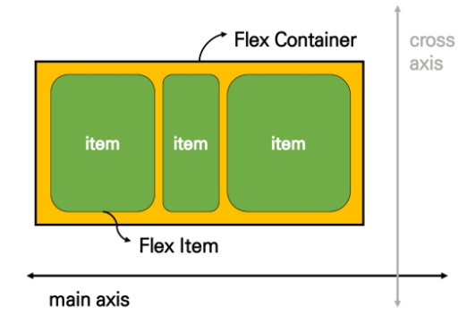

- Flexbox 축
  - flex-direction : row

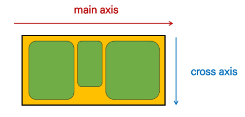

### Flexbox 구성 요소

- Flex Container (부모 요소)
  - flexbox 레이아웃을 형성하는 가장 기본적인 모델
  - Flex Item들이 놓여있는 영역
  - display 속성을 flex 혹은 inline-flex로 지정
- Flex Item (자식 요소)
  - 컨테이너에 속해 있는 컨텐츠(박스)


<span style="color:indianred"><span style="color: **IndianRed**">Flexbox는 수동 값 부여 없이 (1)  수직 정렬 (2) 아이템의 너비와 높이 혹은 간격을 동일하게 배치할 수 있다</span></span>

```css
.flex-container {
    display: flex;
}

# 부모 요소에 display: flex 혹은 inline-flex
```


### Flex 속성

- 배치 설정
  - flex-direction
  - flex-wrap
- 공간 나누기
  - justify-content (main axis)
  - align-content (cross axis)
- 정렬
  - align-items (모든 아이템을 cross axis 기준으로)
  - align-self (개별 아이템)

#### flex-direction

- Main axis 기준 방향 설정
- 역방향의 경우 HTML 태그 선언 순서와 시각적으로 다르니 유의해야 한다 (웹 접근성에 영향)

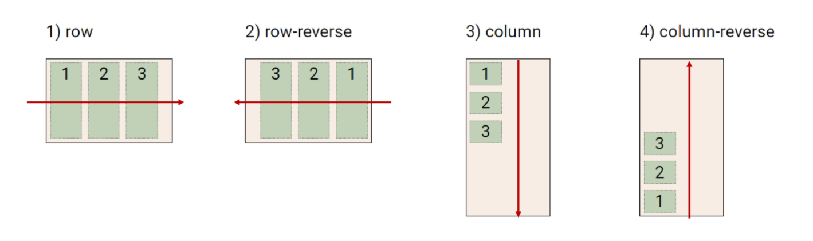

#### flex-wrap

- 아이템이 컨테이너를 벗어나는 경우 해당 영역 내에 배치되도록 설정
- 즉, 기본적으로 컨테이너 영역을 벗어나지 않도록 함
- 요소들이 강제로 한 줄에 배치되게 할 것인지 여부 설정
  - nowrap (기본값) : 한 줄에 배치
  - wrap : 넘치면 그 다음 줄로 배치

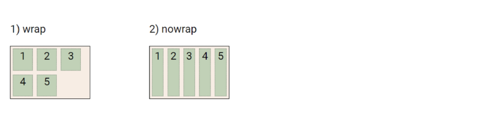

#### flex-flow

- flex-direction 과 flex-wrap의 shorthand
- flex-direction 과 flex-wrap에 대한 설정 값을 차례로 작성
- 예시 ) flex-flow : row nowrap;

#### justify-content

- Main axis를 기준으로 공간 배분


#### align-content

- Cross axis를 기준으로 공간 배분 (아이템이 한 줄로 배치되는 경우 확인할 수 없음)

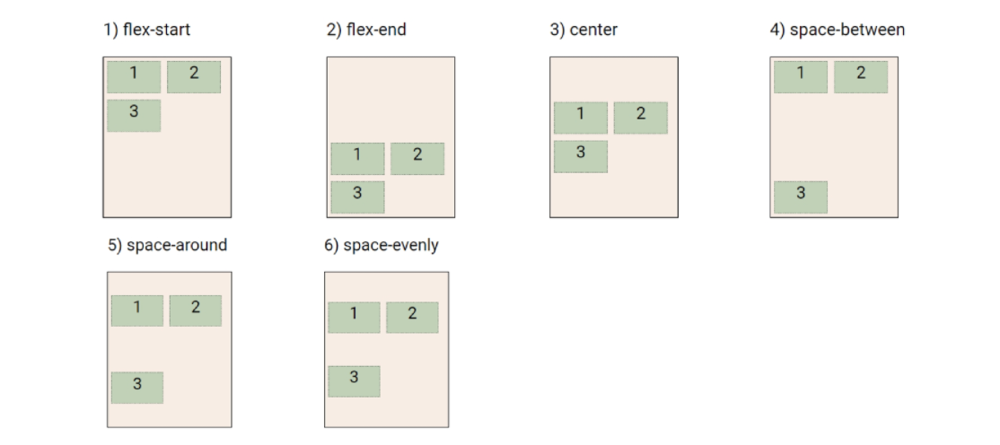

#### justify-content & align-content

- 공간 배분
  - flex-start (기본 값) : 아이템들을 axis 시작점으로 
  - flex-end : 아이템들을 axis 끝 쪽으로
  - center : 아이템들을 axis 중앙으로
  - space-between : 아이템 사이의 간격을 균일하게 분배
  - space-around : 아이템을 둘러싼 영역을 균일하게 분배 (가질 수 있는 영역을 반으로 나눠서 양쪽에)
  - space-evenly : 전체 영역에서 아이템 간 간격을 균일하게 분배

#### align-items

- 모든 아이템을 Cross axis를 기준으로 정렬

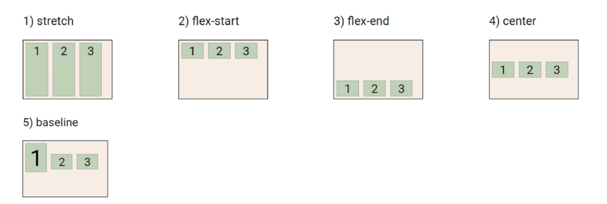

#### align-self

- 개별 아이템을 Cross axis 기준으로 정렬
  - <span style="color:indianred"><span style="color: **IndianRed**">주의! 해당 속성은 컨테이너에 적용하는 것이 아니라 개별 아이템에 적용!!!</span></span>

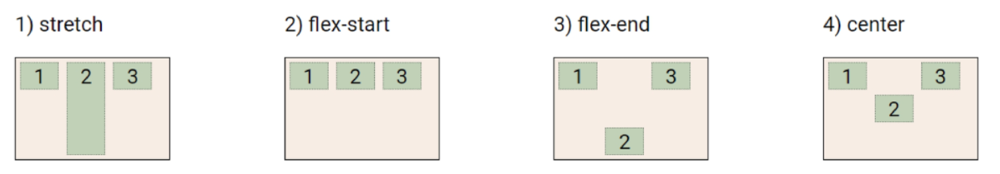

#### align-items & align-self

- Cross axis를 중심으로
  - stretch (기본 값) : 컨테이너를 가득 채움
  - flex-start : 위
  - flex-end : 아래
  - center : 가운데
  - baseline : 텍스트 baseline에 기준선을 맞춤

#### 기타 속성

- flex-grow : 남은  영역을 아이템에 분배
- order : 배치 순서

>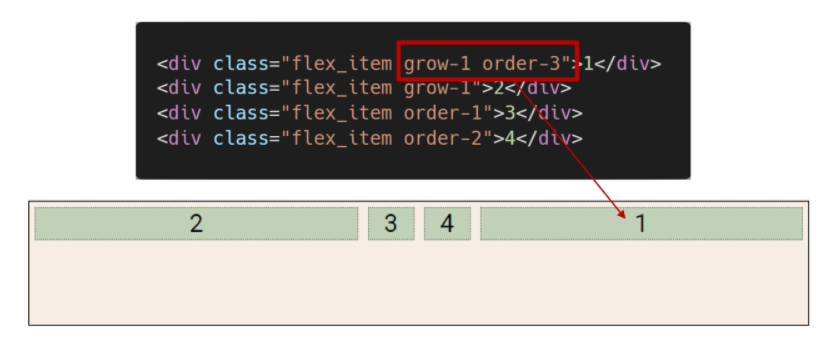

## 레이아웃 활용

### 수직 수평 가운데 정렬

```css
# 방법 1
컨테이너 설정

.container {
    display: flex;
    justify-content: center;
    align-items: center;
}

# 방법 2
아이템 설정

.container {
    display: flex;
}

.item{
    margin: auto;
}
```

> 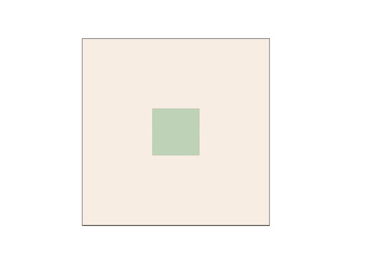

### 카드 배치

```css
#layout_03 {
    display: flex;
    flex-direction: colum;
    flex-wrap: wrap;
    justify-content: space-around;
    align-content: space-around;
}
```

> 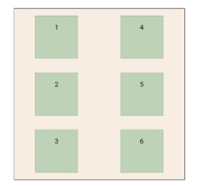

```css
#layout_04{
    display: flex;
    flex-direction: row;
    flex-wrap: wrap;
    justify-content: space-around;
    align-content: space-around;
}
```

> 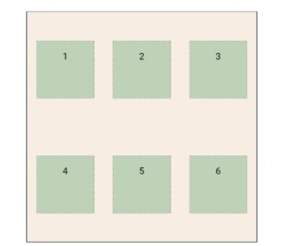