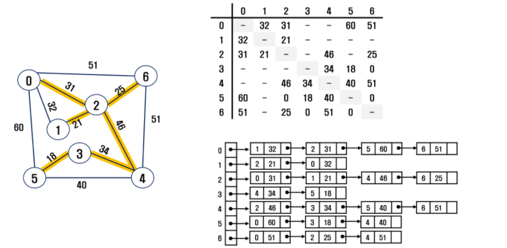
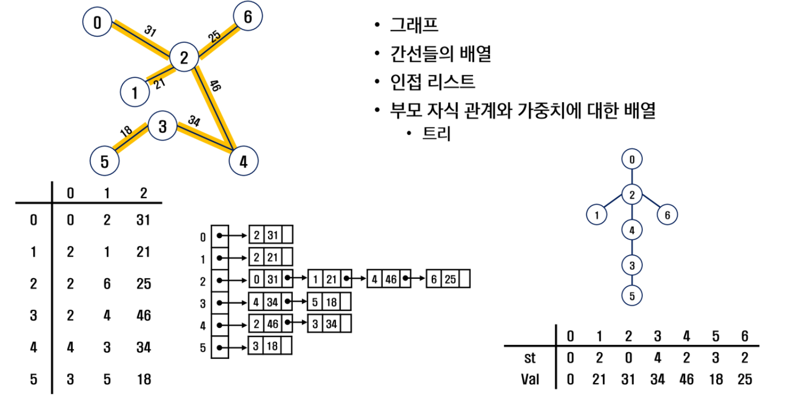
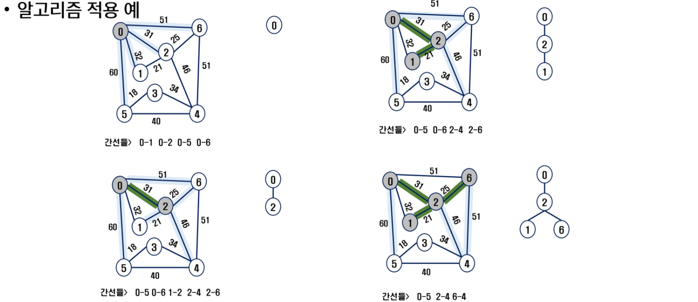
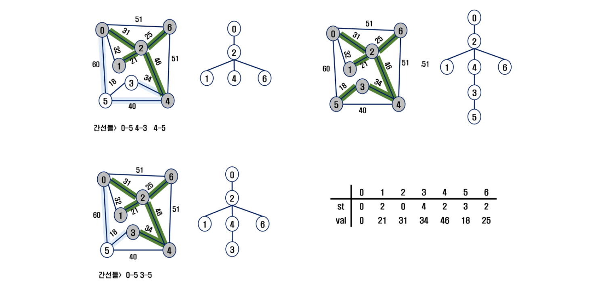
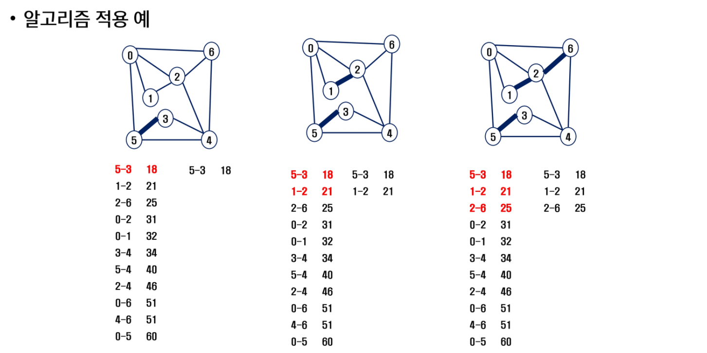
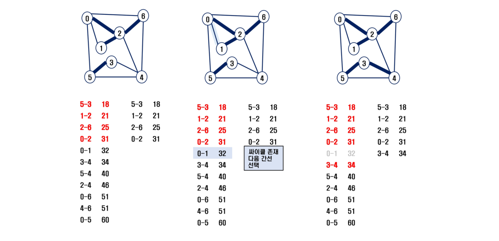
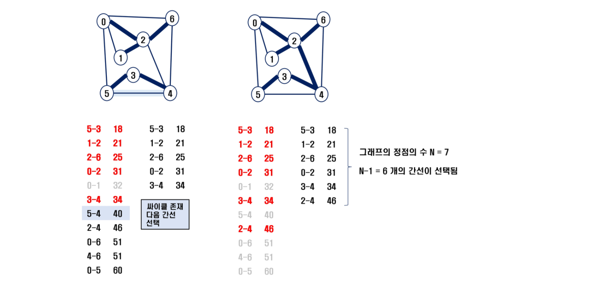

# 🌱 MST(최소 비용 신장 트리)

- 그래프에서 최소 비용 문제
  1. 모든 정점을 연결하는 간선들의 가중치의 합이 최소가 되는 트리
  2. 두 정점 사이의 최소 비용의 경로 찾기
- 신장 트리
  - n 개의 정점으로 이루어진 무방향 그래프에서 n개의 정점과 n-1개의 간선으로 이루어진 트리
- 최소 신장 트리 (Minimum Spanning Tree)
  - 무방향 가중치 그래프에서 신장 트리를 구성하는 간선들의 가중치의 합이 최소인 신장 트리

#### 인접행렬로 MST 표현



#### 인접리스트로 MST 표현




### Prim 알고리즘

> 하나의 정점에서 연결된 간선들 중에 하나씩 선택하면서 MST를 만들어 가는 방식

1. 임의 정점을 하나 선택해서 시작
2. 선택한 정점과 인접하는 정점들 중의 최소 비용의 간선이 존재하는 정점을 선택
3. 모든 정점이 선택될 때 까지 1, 2 과정을 반복

- 서로소인 2개의 집합 정보를 유지
  - 트리 정점들 - MST를 만들기 위해 선택된 장점들
  - 비트리 정점들 - 선택 되지 않은 정점들





```python
'''
6 11
0 1 32
0 2 31
0 5 60
0 6 51
1 2 21
2 4 46
2 6 25
3 4 34
3 5 18
4 5 40
4 6 51
'''

def prim1(r, V):
    MST = [0]*(V+1)     # MST 포함여부
    key = [10000]*(V+1) # 가중치의 최대값 이상으로 초기화. key[v]는 v가 MST에 속한 정점과 연결될 때의 가중치
    key[r] = 0          # 시작정점의 key
    for _ in range(V):  # V+1개의 정점 중 V개를 선택
        # MST에 포함되지 않은 정점 중(MST[u]==0), key가 최소인 u 찾기
        u = 0
        minV = 10000
        for i in range(V+1):
            if MST[i]==0 and key[i]<minV:
                u = i
                minV = key[i]
        MST[u] = 1                  # 정점 u를 MST에 추가
        # u에 인접인 v에 대해, MST에 포함되지 않은 정점이면
        for v in range(V+1):
            if MST[v]==0 and adjM[u][v]>0:
                key[v] = min(key[v], adjM[u][v])     # u를 통해 MST에 포함되는 비용과 기존 비용을 비교, 갱신
    return sum(key)         # MST 가중치의 합

def prim2(r, V):
    MST = [0]*(V+1)     # MST 포함여부
    MST[r] = 1
    s = 0
    for _ in range(V):
        u = 0
        minV = 10000
        for i in range(V+1):    # MST에 포함된 정점i와 인접한 정점j 중 MST에 포함되지 않고 가중치가 최소인 정점 u찾기
            if MST[i]==1:
                for j in range(V+1):
                    if adjM[i][j]>0 and MST[j]==0 and minV>adjM[i][j]:
                        u = j
                        minV = adjM[i][j]
        s += minV
        MST[u] = 1
    return s

V, E = map(int, input().split())
adjM = [[0]*(V+1) for _ in range(V+1)]
adjL = [[] for _ in range(V+1)]
for _ in range(E):
    u, v, w = map(int, input().split())
    adjM[u][v] = w
    adjM[v][u] = w  # 가중치가 있는 무방향 그래프
    adjL[u].append((v, w))
    adjL[v].append((u, w))
print(adjM)
print(adjL)
#print(prim1(0, V))
print(prim2(0, V))
```


### KRUSKAL 알고리즘

> 간선을 하나씩 선택해서 MST를 찾는 알고리즘

1. 최초, 모든 간선을 가중치에 따라 **<u>오름차순</u>**으로 정렬
2. 가중치가 가장 낮은 간선부터 선택하면서 트리를 증가시킴
   - 사이클이 존재하면 다음으로 가중치가 낮은 간선 선택
3. `n-1` 개의 간선이 선택될 때 까지 2를 반복







```python
def find_set(x):
    while x!=rep[x]:
        x = rep[x]
    return x

def union(x, y):
    rep[find_set(y)] = find_set(x)

V, E = map(int, input().split())    # V 마지막 정점, 0~V번 정점. 개수 (V+1)개
edge = []
for _ in range(E):
    u, v, w = map(int, input().split())
    edge.append([w, v, u])
edge.sort()
rep = [i for i in range(V+1)]       # 대표원소 배열
# MST의 간선수 N = 정점 수 - 1
N = V + 1
cnt = 0     # 선택한 edge의 수
total = 0   # MST 가중치의 합
for w, v, u in edge:
    if find_set(v) != find_set(u):
        cnt += 1
        union(u, v)
        total += w
        if cnt == N-1:  # MST 구성이 끝나면
            break
print(total)
```

