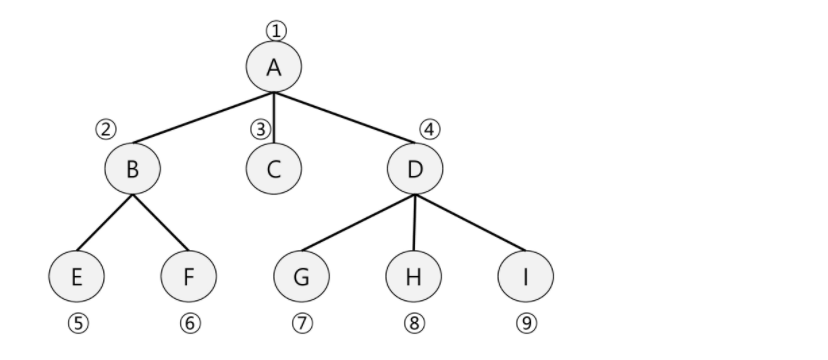

# 🌱 큐(Queue)

## 큐(Queue)의 특성

- 스택과 마찬가지로 삽입과 삭제의 위치가 제한적인 자료구조
  - 큐의 뒤에서는 삽입만 하고, 큐의 앞에서는 삭제만 이루어지는 구조
- 선입선출구조(FIFO : First In First Out)
  - 큐에 삽입한 순서대로 원소가 저장되어, 가장 먼저 삽입된 원소는 가장 먼저 삭제된다.

| 연산          | 기능                                                |
| ------------- | --------------------------------------------------- |
| enQueue(item) | 큐의 뒤쪽(rear 다음)에 원소를 삽입하는 연산         |
| deQueue()     | 큐의 압쪽(front)에서 원소를 삭제하고 반환하는 연산  |
| createQueue() | 공백 상태의 큐를 생성하는 연산                      |
| isEmpty()     | 큐가 공백 상태인지를 확인하는 연산                  |
| isFull()      | 큐가 포화상태인지를 확인하는 연산                   |
| Qppek()       | 큐의 앞쪽(front)에서 원소를 삭제 없이 반환하는 연산 |

##  선형 큐

- 1차원 배열을 이용한 큐
  - 큐의 크기 = 배열의 크기
  - front : 저장된 첫 번째 원소의 인덱스
  - rear : 저장된 마지막 원소의 인덱스
- 상태 표현
  - 초기 상태 : front = rear = -1
  - 공백 상태 : front == rear
  - 포화 상태 : rear == n-1 (n : 배열의 크기, n-1 : 배열의 마지막 인덱스)

**<u>간단한 큐 구현 해보기</u>**

> 큐를 구현하여 다음 동작을 확인해 보자
>
> - 3 개의 데이터 1, 2, 3을 차례로 큐에 삽입하고
> - 큐에서 3개의 데이터를 차례로 꺼내서 출력한다.
> - 1, 2, 3이 출력되어야 함


```python
front = -1
rear = -1
Q = [0] * 10
for i in range(1, 4):
    rear += 1
    Q[rear] = i
    
for i in range(1, 4):
    front += 1
    print(Q[front])

```

#### <u>선형 큐 이용시의 문제점</u>

- 선형 큐를 이용하여 원소의 삽입과 삭제를 계속할 경우, 배열의 앞부분에 활용할 수 있는 공간이 있음에도 불구하고 rear = n-1인 상태 즉, 포화상태로 인식하여 더이상의 삽입을 수행하지 않게 됨
- 따라서 매 연산이 이루어질때마다 저장된 원소들을 배열 앞부분으로 모두 이동시켜야 하는데, 이 방법은 많은 시간이 소요되어 큐의 효율성이 급격히 떨어진다. 그래서 나온 것이 바로 **원형 큐**

## 원형 큐

- 초기 공백 상태
  - front = rear = 0
- Index의 순환
  - front와 rear의 위치가 배열의 마지막 인덱스인 n-1을 가리킨 후 그 다음에는 논리적 순환을 이루어 배열의 처음 인덱스인 0으로 이동해야함
  - 이때 나머지 연산자 mod를 사용한다!
- front 변수
  - 공백 상태와 포화 상태 구분을 쉽게 하기 위해 **front가 있는 자리는 사용하지 않고 항상 빈자리로 둠**
- 삽입 위치 및 삭제 위치

|             | 삽입 위치                 | 삭제 위치                   |
| ----------- | ------------------------- | --------------------------- |
| 선형 큐     | rear = rear + 1           | front = front + 1           |
| **원형 큐** | **rear = (rear + 1) % n** | **front = (front + 1) % n** |

**<u>공백상태 및 포화상태 검사 : isEmpty(), isFull()</u>**

> 공백상태 : front = rear
>
> 포화상태 : 삽입할 rear의 다음 위치 == 현재 front  => (rear + 1) % n == front

```python
def isEmpty():
    return front == rear

def isFull():
    return (rear+1) % len(Q) == front

```

<u>**삽입, 삭제 : enQueue(item), deQueue**</u>

```python
# 삽입
def enQueue(item):
    global rear
    if isFull():
        print('Queue_Full')
    else:
        rear = (rear + 1) % len(Q)
        Q[rear] = item
# 삭제
def deQueue():
    global front
    if isEmpty():
        print('Queue_Empty')
    else:
        front = (front + 1) % len(Q)
        return Q[front]
 
```

### 큐 연습문제

> 마이쮸 나눠주기 시뮬레이션
>
> - 1번이 줄서서 한 개의 마이쮸를 받은 후 다시 줄을 서고 새로 2번이 다시 줄을 선다.
> - 1번은 두번째 줄섰기 때문에 두 개의 마이쮸를 받고 다시 줄을 서고 새로 3번이 다시 줄을 선다.
> - 2번이 줄서서 한 개의 마이쮸를 받고 다시 줄을 서고 새로 4번이 다시 줄을 선다.
> - 1번은 세번째 줄섰기 때문에 세 개의 마이쮸를 받은 후 다시 줄을 서고 새로 5번이 다시 줄을 선다.
> - 20개의 마이쮸 중에 마지막 것을 누가 가져갈까?


## BFS (Breadth First Search)

> 너비우선탐색은 탐색 시작점의 인접한 정점들을 먼저 모두 차례로 방문한 후에 방문했던 정점을 시작점으로 하여 다시 인첩한 정점들을 차례로 방문하는 방식, 인접한 정점들에 대해 탐색을 한 후, 차례로 다시 너비우선탐색을 진행해야 하므로, 선입선출 형태의 자료구조인 큐를 활용한다.

- 다음과 같은 순서로 탐색한다! (A - B - C - D - E - F - G -H - I)



```python
# 그래프 G, 탐색 시작점 v
def bfs(G, v):
    visited = [0] * (n+1)
    queue = []
    queue.append(v)
    while queue:
        t = queue.pop(0)
        if not visited[t]:
            visited[t] = True
            visit(t)
        for i in G[t]:
            if not visited[i]:
                queue.append(i)
```


큐의 중복된 정보가 들어가 경우에 큐를 얼마나 크게 만들어야 할까?

=> visited를 처리된 애를 체크했다면, 줄서고 있는애들로 바꾸면 된다!

- visited 배열 초기화

- Q 생성

- 시적점 enqueue, 시작점 줄섬 표시

  위 과정은 while문 전에

  ```python
  # 그래프 G, 탐색 시작점 v
  def bfs(G, v, n):
      visited = [0] * (n+1)
      queue = []
      queue.append(v)
      visited[0] = 1  # 시작점 줄섬 표시
      while queue:
          t = queue.pop(0)
          visit(t) # print(t) 하면 방문한 순서 찍힘, visit(t) 부분에서 어떤 목적 코드  실행
          for i in G[t]:
              if not visited[i]:
                  # 그냥 1해줘도 갠츈, 
                  visited[i] = visited[t] + 1
                  queue.append(i)
  ```

  

|         | A    | B    | C    | D    | E    | F    | G    | H    | I    |
| ------- | ---- | ---- | ---- | ---- | ---- | ---- | ---- | ---- | ---- |
| Visited | [0]  | [1]  | [2]  | [3]  | [4]  | [5]  | [6]  | [7]  | [8]  |
| Queue   | 1    | 2    | 2    | 2    | 3    | 3    | 3    | 3    | 3    |
|         | A    | B    | C    | D    | E    | F    | G    | H    | I    |

