# 🌱그래프 최단 경로

> 간선의 가중치가 있는 그래프에서 두 정점 사이의 경로들 중에 간선의 가중치의 합이 최소인 경로

- 하나의 시작 정점에서 끝 정점까지의 최단 경로

  - 다익스트라(dijkstra) 알고리즘 (음의 가중치를 허용하지 않음)

  - 벨만-포드(Bellman-Ford) 알고리즘 (음의 가중치 허용)


- 모든 정점들에 대한 최단 경로
  - 플로이드-워샬(Floyd-Warshall) 알고리즘


## 다익스트라(Dijkstra) 알고리즘

> 시작 정점에서 거리가 최소인 정점을 선택해 나가면서 최단 경로를 구하는 방식

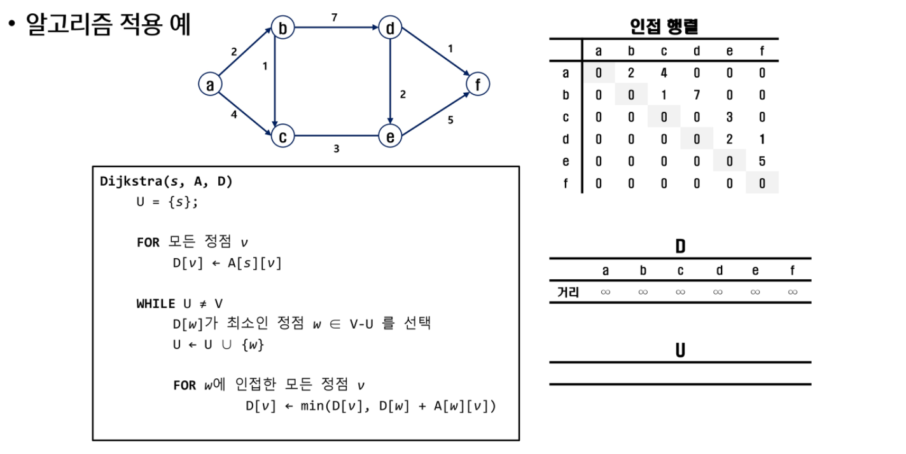

- s : 시작 정점
- A : 인접 행렬
- D : 시작점 (a)에서 거리를 담은 리스트
- V : 정점 집합
- U : 선택된 정점 집합

1. ```BASH
   a에서 출발하기 때문에 U에 a를 추가, 그리고 a에서 갈 수 있는 b와 c의 거리를 D에 추가
   ```

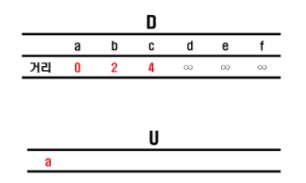

2. ```bash
   b와 c중 가중치가 낮은 b를 U에 추가, 현재 선택된 경로는 a - b이기 때문에 c와 d의 거리를 조정
   ```

   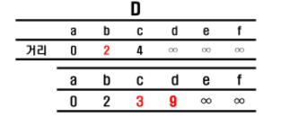

   

3. ```bash
   c와 d 중 가중치가 낮은 d를 U에 추가, 현재 선택된 경로는 a - b- c, d와 e의 거리 조정
   ```

   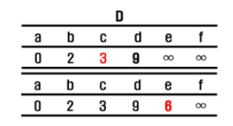

   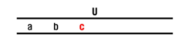

4. ```bash
   가중치가 낮은 e를 U에 추가, e와 f 거리 조정
   ```

   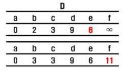

   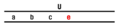

5. ```bash
   가중치가 낮은 d를 U에 추가, f 거리 조정
   ```

   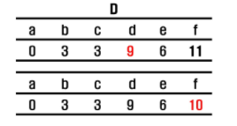

   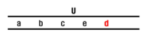

6. ```bash
   마지막 f에 도착
   ```

   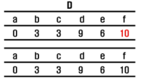

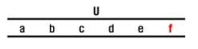

7. 결과

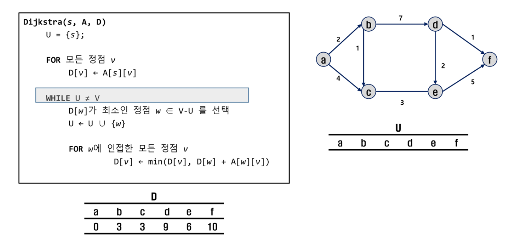

### 구현 - 인접 행렬

```python
'''
5 11
0 1 3
0 2 5
1 2 2
1 3 6
2 1 1
2 3 4
2 4 6
3 4 2
3 5 3
4 0 3
4 5 6
'''

def dijkstra(s, V):
    U = [0]*(V+1)       # 비용이 결정된 정점을 표시
    U[s] = 1            # 출발점 비용 결정
    for i in range(V+1):
        D[i] = adjM[s][i]

    # 남은 정점의 비용 결정
    for _ in range(V):      # 남은 정점 개수만큼 반복
        # D[w]가 최소인 w 결정, 비용이 결정되지 않은 정점w 중에서
        minV = INF
        w = 0
        for i in range(V+1):
            if U[i] == 0 and minV > D[i]:
                minV = D[i]
                w = i
        U[w] = 1                # 비용 결정
        for v in range(V+1):
            if 0< adjM[w][v]< INF:
                D[v] = min(D[v], D[w]+adjM[w][v])

INF = 10000
V, E = map(int, input().split())
adjM = [[INF]*(V+1) for _ in range(V+1)]
for i in range(V+1):
    adjM[i][i] = 0
for _ in range(E):
    u, v, w = map(int, input().split())
    adjM[u][v] = w

D = [0]*(V+1)
dijkstra(0, V)
print(D)
```

### 구현 - 인접 리스트

```python
'''
5 11
0 1 3
0 2 5
1 2 2
1 3 6
2 1 1
2 3 4
2 4 6
3 4 2
3 5 3
4 0 3
4 5 6
'''
def dijkstra(s, V):
    U = [0]*(V+1)       # 비용이 결정된 정점을 표시
    U[s] = 1            # 출발점 비용 결정
    D[s] = 0
    for v, w in adjL[s]:
        D[v] = w

    # 남은 정점의 비용 결정
    for _ in range(V):      # 남은 정점 개수만큼 반복
        # D[t]가 최소인 t 결정, 비용이 결정되지 않은 정점t 중에서
        minV = INF
        t = 0
        for i in range(V+1):
            if U[i] == 0 and minV > D[i]:
                minV = D[i]
                t = i
        U[t] = 1                # 비용 결정
        for v, w in adjL[t]:
                D[v] = min(D[v], D[t]+w)

INF = 10000
V, E = map(int, input().split())
adjL = [[] for _ in range(V+1)]
for _ in range(E):
    u, v, w = map(int, input().split())
    adjL[u].append([v, w])

D = [INF]*(V+1)
dijkstra(0, V)
print(D)
```

