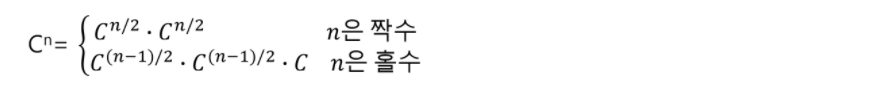
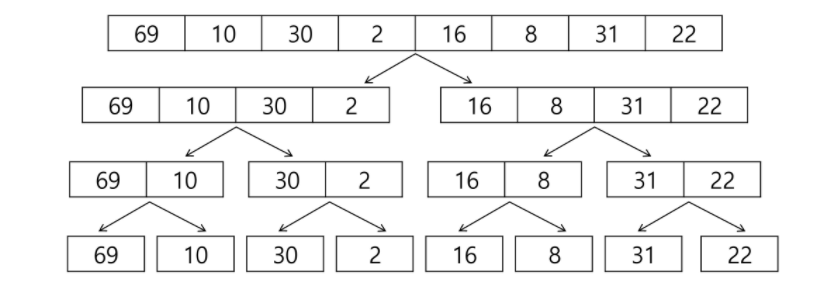
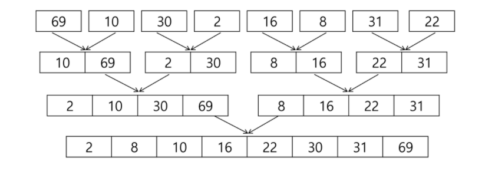
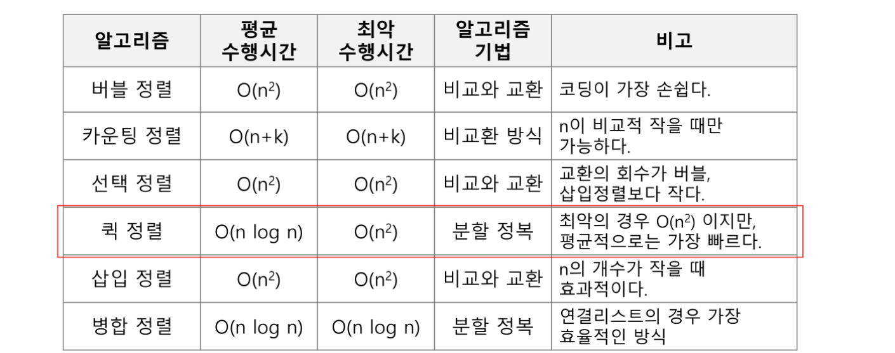

# 🌱 분할 정복

- 분할 : 해결할 문제를 여러 개의 작은 부분으로 나눈다.
- 정복 : 나눈 작은 문제를 각각 해결한다.
- 통합 : (필요하다면) 해결된 해답을 모은다.

## 거듭 제곱

**Cn = C X C X C ... X C**

```python
def power(base, exponent):
    if base == 0:
        return 1
    result = 1
    for i in range(exponent):
        result *= base
    return result
```



```python
def power(base, exponent):
    if exponent == 0 or base == 0:
        return 1
    
    if exponent % 2 == 0:
        newbase = power(base, exponent/2)
        return newbase * newbase
    else:
        newbase = power(base, (exponent-1)/2)
        return (newbase * newbase) * base
```


## 병합 정렬(Merge Sort)

- 여러 개의 정렬된 자료의 집합을 병합하여 한 개의 정렬된 집합으로 만드는 방식
- 자료를 최소 단위의 문제까지 나눈 후에 차례대로 정렬하여 최종 결과를 얻어냄.
- O(nlogn)

### 병합 정렬 과정

- `[69, 10, 30, 2, 16, 8, 31, 22]`를 병합 정렬하는 과정
- 분할 단계: 전체 자료 집합에 대하여, 최소 크기의 부분집합이 될 때까지 분할 작업을 계속한다.



- 병합 단계: 2개의 부분집합을 정렬하면서 하나의 집합으로 병합하는 식으로 모든 부분집합을 정렬 하면서 병합하여 1개의 집합으로 병합될 때까지 반복한다. 



```python
def split(lst, n):
    global cnt
    if n == 1:
        return lst
    left = lst[:n // 2]
    right = lst[n // 2:]
    left = split(left, len(left))
    right = split(right, len(right))
    return merge(left, right)
 
def merge(left, right):
    check = []
    i = j = 0
    while i < len(left) or j < len(right):
        if i < len(left) and j < len(right):
            if left[i] <= right[j]:
                check.append(left[i])
                i += 1
            else:
                check.append(right[j])
                j += 1
        elif len(left) > i:
            check.append(left[i])
            i += 1
        elif len(right) > j:
            check.append(right[j])
            j += 1
    return check

lst = [69, 10, 30, 2, 16, 8, 31, 22]
n = len(lst)
print(split(lst, n))
```


## 퀵 정렬

- 주어진 배열을 2개로 분할하고, 각각을 정렬하는 방식
- 합병 정렬과 다른 점
  1. 합법정렬은 그냥 두 부분으로 나누는 반면에, 퀵 정렬은 분할할 때, 기준 아이템 기준으로, 이보다 작은 것은 왼편, 큰 것은 오른편에 위치시킨다.
  2. 각 부분 정렬이 끝난 후, 합병정렬은 '합병'이란 후처리 작업이 필요하지만 퀵 정렬은 필요없음

```python
def quickSort(a, begin, end):
    if begin < end:
        p = partition(a, begin, end)
        quickSort(a, begin, p-1)
        quickSort(a, p+1, end)
        
def partition (a, begin, end):
    pivot = (begin + end) // 2
    L = begin
    R = end
    while L < R:
        while(L < R and a[L] < a[pivot]) : L += 1
        while(L < R and a[R] >= a[pivot]) : R -= 1
        if L < R:
            if L == pivot : pivot = R
            a[L], a[R] = a[R], a[L]
    a[pivot], a[R] = a[R], a[pivot]
    return R
     
a = [69, 10, 30, 2, 16, 8, 31, 22]
begin = 0
end = 7
quickSort(a, begin, end)
```

**퀵 정렬 수행 과정 [2, 10, 30, 8, 16, 69, 31, 22]**

1. 원소의 개수가 8개니까 4번째 자리에 있는 2를 첫 번째 피봇으로 선택하고 퀵 정렬을 시작한다.
   - L은 제일 왼쪽인 69부터 시작해서 오른쪽으로 이동하면서 피봇(2) 보다 크거나 같은 원소를 찾고, R은 제일 오른쪽인 22부터 시작해서 왼쪽으로 이동하면서 피봇보다 작은 원소를 찾는다.
   - L은 원소 69를 찾았고 R은 피봇 보다 작은 원소를 찾지 못한채로 원소 69에서 L과 만나게 되고 L과 R이 만났기 때문에 원소 69와 피봇(2)을 교환하여 피봇 원소 2의 위치를 확정한다. 
   - [<u>2</u>, 10, 30, <u>69</u>, 16, 8, 31, 22]

2. 피봇 2의 왼쪽 부분 집합은 더이상 분할하지 않기 때문에 퀵 정렬을 수행하지  않고, 오른 쪽 부분 집합에 대해서 퀵정렬 수행
   - 오른 쪽 부분 집합의 원소가 7개 이기 때문에 가운데 있는 원소 16을 피봇으로 선택
   - L은 원소 30과 R이 찾은 8을 서로 교환한다.
   - [2, 10, <u>8</u>, 69, 16, <u>30</u>, 31, 22]
   - 현재 위치에서 L과 R의 작업을 반복한다.
   - L은 원소 69를 찾았지만, R은 피봇 보다 작은 원소를 찾지 못한 채로 원소 69에서 L과 만나게 되기 때문에 원소 69를 피봇과 교환하여 피봇 원소 16의 위치를 확정한다.
   - [2, 10, 8, <u>16</u>, <u>69</u>, 30, 31, 22]
3. 피봇 16의 왼쪽 부분 집합에서 원소 10을 피봇으로 선택하여 퀵 정렬을 수행
   - L의 원소 10과 R의 원소 8을 교환하는데, L의 원소가 피봇이고 피봇 원소에 대한 자리교환이 발생한 것이므로 교환의 자리를 피봇 원소 10의 위치로 확정한다.
   - [2, <u>8</u>, <u>10</u>, 16, 69, 30, 31, 22]

4. 피봇 10의 확정된 위치에서 왼쪽 부분 집합은 원소가 한 개(8) 이므로 퀵정렬을 수행하지 않고 오른쪽 부분집합 (16) 역시 공집합이므로 퀵정렬을 수행하지 않고, 전 단계 피봇이었던 원소 16의 오른쪽 부분 집합에 대해 퀵 정렬을 수행한다. 오
   - 오른쪽 부분 집합의 원소가 4개 이므로 두번 째 원소 (30)을 피봇으로 선택한다.
   - L이 찾은 69와 R이 찾은 22를 서로 교환한다.
   - [2, 8, 10, 16, <u>22</u>, 30, 31, <u>69</u>]
   - 현재 위치에서 L과 R의 작업을 반복하면, L은 오른쪽으로 이동하면서 피봇 보다 크거나 같은 원소인 30을 찾고, R은 왼쪽으로 이동하면서 피봇보다 작은 원소를 못찾고 원소 30에서 L과 만난다.
   - L과 R이 만났기 때문에 피봇과 교환한다. 이 때 R의 원소가 피봇이므로 피봇에 대한 자리 교환이 발생하며 교환한 자리를 피봇의 자리로 확정한다.
   - [2, 8, 10, 16, 22, <u>30</u>, 31, 69] =>  30의 자리 확정

5. 피봇 30의 확정된 위치에서 왼쪽 부분 집합의 원소가 1개 이기 때문에 퀵 정렬을 수행하지 않고, 오른쪽 부분 집합에 대해서 퀵 정렬을 수행한다.
   - 오른쪽 부분 집합의 원소 2개 중 원소 31을 피봇으로 선택한다.
   - L은 31을 찾고 R은 피봇 보다 작은 원소를 못 찾고 31에서 L과 만나고, R의 원소가 피봇이므로 결국 제자리가 확정된다.
   - [2, 8, 10, 16, 22, 30, <u>31</u>, 69] =>  31의 자리 확정

6. 피봇 31의 오른쪽 부분 집합의  원소가 한 개이므로 퀵 정렬을 수행하지 않는다. 이것으로 전체 퀵 정렬 완성
   - [2, 8, 10, 16, 22, 30, 31, <u>69</u>] =>  69의 자리 확정

