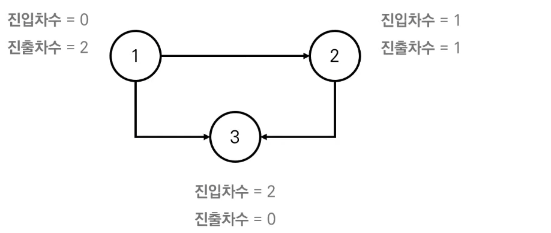

# 위상정렬

> 사이클이 없는 방향 그래프의 모든 노드를 방향성에 거스르지 않도록 순서대로 나열하는 것을 의미한다.

```python
# 빠른게 코드만 보자
/* 입력 데이터
3 2
1 3
2 3
*/

n, m = map(int, input().split())
# 진입 차수
indegree = [0] * (n+1) 
# 진출 차수
adj = [[] for _ in range(n+1)]

for _ in range(m):
    a, b = map(int, sys.stdin.readline().split())
    adj[a].append(b)
    indegree[b] += 1

# q에 진입차수가 0인 애들 담아주기
q = deque([])
for i in range(1, n+1):
    if not indegree[i]:
        q.append(i)

while q:
    x = q.popleft()
    print(x)
    for i in adj[x]:
        # 진입차수와 진출차수를 이어주는 간선 제거
        indegree[i] -= 1
        # 진입차수가 없다면 q에 넣기
        if not indegree[i]:
            q.append(i)
```


<br>



#### 진입 차수(Indegree) 

- 특정한 노드로 들어오는 간선의 개수

#### 진출 차수(Outdegree) 

- 특정한 노드에서 나가는 간선의 개수

<br>

#### 알고리즘

1. 먼저 진입 차수가 0인 노드를 큐에 넣는다.
2. 큐에서 차례대로 값을 꺼내 다음의 과정을 반복한다.
   1. 큐에서 꺼낸 노드에서 나가는 간선을 그래프에서 제거한다 (해당 노드의 진출 차수 간선 제거)
   2. 새롭게 진입 차수가 0이 된 노드를 큐에 넣는다.
3. 결과적으로 각 노드가 큐에 들어온 순서가 위상 정렬을 수행하는 결과와 같다.

[참고](https://freedeveloper.tistory.com/390)