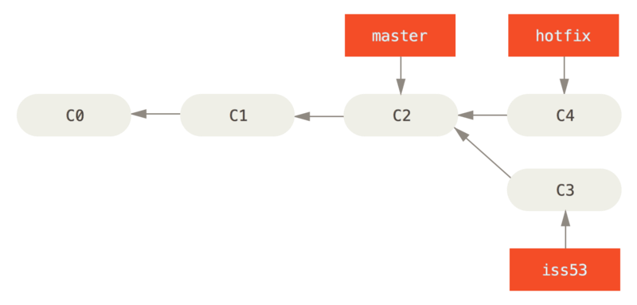
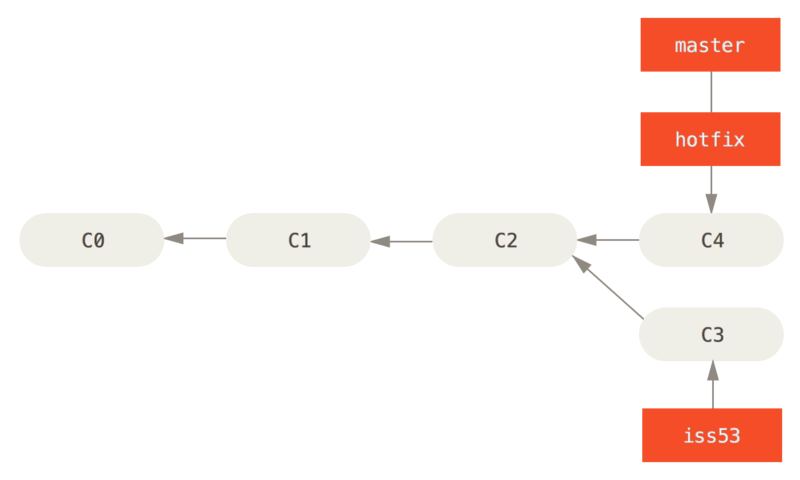
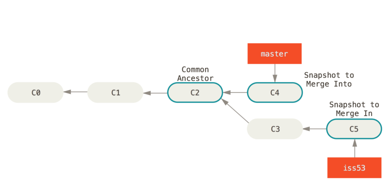
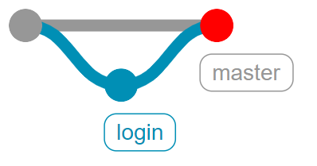
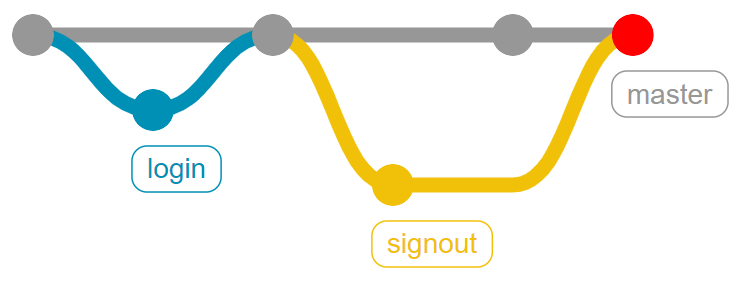
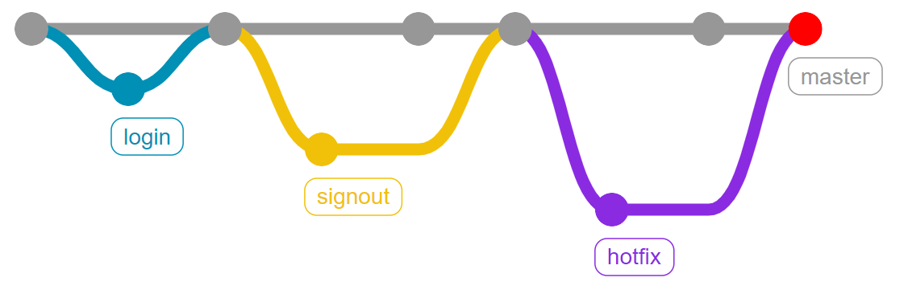
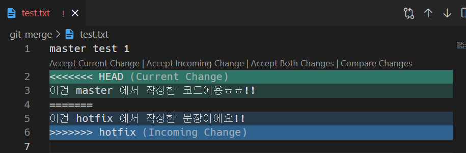
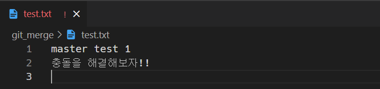
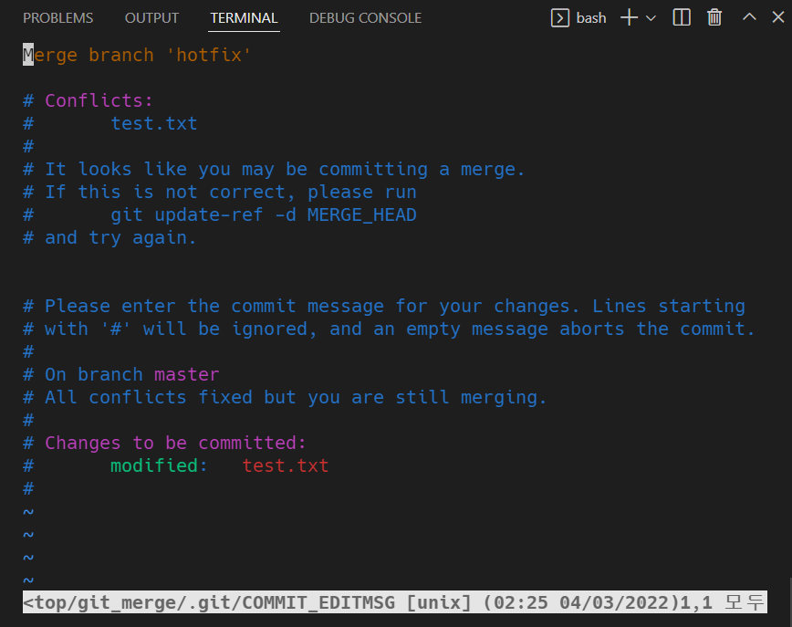

[toc]

## Branch Merge

> 이제 각 브랜치에서의 작업이 끝나면 어떻게 할까요? 
> 그 작업 내용을 master에 반영해야 하지 않을까요? 
> 지금부터는 Merge라고 하는 병합을 학습하면서 브랜치를 합치는 것을 살펴보자.

### git merge

- 분기된 브랜치들을 하나로 합치는 명령어

- `git merge <합칠 브랜치 이름>`의 형태로 사용합니다.

- **Merge하기 전에 일단 다른 브랜치를 합치려고 하는, 즉 메인 브랜치로 switch 해야합니다.**

  ```bash
  # 1. 현재 branch1과 branch2가 있고, HEAD가 가리키는 곳은 branch1 입니다.
  $ git branch
  * branch1
    branch2
  
  # 2. branch2를 branch1에 합치려면?
  $ git merge branch2
  
  # 3. branch1을 branch2에 합치려면?
  $ git switch branch2
  $ git merge branch1
  ```

<br>

### Merge의 세 종류

#### 1. Fast-Forward

> 브랜치를 병합할 때 마치 빨리감기처럼 브랜치가 가리키는 커밋을 앞으로 이동시키는 것

1. 현재 master는 C2 커밋을, hotfix는 C4 커밋을 가리키고 있습니다.

   

2. master에 hotfix를 병합하면 어떻게 될까요?

   ```bash
   $ git switch master
   $ git merge hotfix
   Updating s1d5f1s..1325sd4
   Fast-forward
    index.html | 2 ++
    1 file changed, 2 insertions(+)
   ```

3. hotfix가 가리키는 C4는 C2에 기반한 커밋이므로, master가 C4에 이동하게 됩니다.
   이렇게 따로 merge 과정 없이 브랜치의 포인터가 이동하는 것을 Fast-Forward라고 합니다.
   

4. 병합이 완료된 hotfix는 더 이상 필요 없으므로 삭제합니다.

   ```bash
   $ git branch -d hotfix
   Deleted branch hotfix (1325sd4).
   ```

<br>

#### 2. 3-Way Merge (Merge commit)

> - 브랜치를 병합할 때 `각 브랜치의 커밋 두개와 공통 조상 하나`를 사용하여 병합하는 것
> - 두 브랜치에서 `다른 파일` 혹은 `같은 파일의 다른 부분`을 수정했을 때 가능합니다.

1. 현재 master는 C4 커밋을, iss53은 C5 커밋을 가리키고 있습니다.
   master와 iss53의 공통 조상은 C2 커밋입니다.
   

2. 이 상황에서 master에 iss53을 병합하면 어떻게 될까요?

   ```bash
   $ git switch master
   Switched to branch 'master'
   $ git merge iss53
   Merge made by the 'ort' strategy.
   index.html |    1 +
   1 file changed, 1 insertion(+)
   ```

3. master와 iss53은 갈래가 나누어져 있기 때문에 Fast-Forward로 합쳐질 수 없습니다.
   따라서 공통 조상인 C2와 각자가 가리키는 커밋인 C4, C5를 비교하여 `3-way merge`를 진행합니다.

   

4. 이때 생긴 C6는 master와 iss53이 병합되면서 발생한 Merge Commit입니다.

5. 병합이 완료된 iss53은 더 이상 필요 없으므로 삭제합니다.

   ```bash
   $ git branch -d iss53
   Deleted branch iss53 (58sdf23).
   ```

<br>

#### 3. Merge Conflict

> - 병합하는 두 브랜치에서 `같은 파일의 같은 부분`을 수정한 경우, Git이 어느 브랜치의 내용으로 작성해야 하는지 판단하지 못해 발생하는 충돌(Conflict) 현상
> - 결국은 사용자가 직접 내용을 선택해서 Conflict를 해결해야 합니다.

1. 현재 master는 C4 커밋을, iss53은 C5 커밋을 가리키고 있습니다.
   master와 iss53의 공통 조상은 C2 커밋입니다. `(3-way merge에서의 상황과 같습니다)`

   

2. 3-way merge와는 달리, 만약 master와 iss53이 같은 파일의 같은 부분을 수정하고 병합한다면 어떤 일이 발생할까요?

   ```bash
   $ git merge iss53
   Auto-merging index.html
   CONFLICT (content): Merge conflict in index.html
   Automatic merge failed; fix conflicts and then commit the result.
   ```

3. 충돌이 일어난 파일을 확인하기 위해 git status를 입력합니다.

   ```bash
   $ git status
   On branch master
   You have unmerged paths.
     (fix conflicts and run "git commit")
   
   Unmerged paths:
     (use "git add <file>..." to mark resolution)
   
       both modified:      index.html
   
   no changes added to commit (use "git add" and/or "git commit -a")
   ```

4. `index.html`을 열어보면 아래와 같이 충돌 내역이 나옵니다.

   ```html
   <<<<<<< HEAD:index.html
   <div id="footer">contact : email.support@github.com</div>
   =======
   <div id="footer">
    please contact us at support@github.com
   </div>
   >>>>>>> iss53:index.html
   ```

5. `=======` 를 기준으로 위는 master의 내용, 아래는 iss53의 내용입니다.
   이 중 하나를 선택할 수도 있고, 둘 다 선택할 수도 있고, 아예 새롭게 작성할 수도 있습니다.

   ```html
   <div id="footer">
   please contact us at email.support@github.com
   </div>
   ```

6. 이후 git add와 git commit을 통해 병합한 내용을 커밋할 수 있습니다.

   ```bash
   $ git add .
   $ git commit
   ```

7. Vim 편집기가 켜지며 이ㅏ를 이용해서 커밋 내역을 수정할 수 있습니다.
   (수정을 마치거나 수정할 것이 더이상 없을 경우 `esc` 를 누른후`:wq` 를 입력하여 저장 & 종료)

   ```bash
   Merge branch 'iss53'
   
   Conflicts:
       index.html
   #
   # It looks like you may be committing a merge.
   # If this is not correct, please remove the file
   #	.git/MERGE_HEAD
   # and try again.
   
   
   # Please enter the commit message for your changes. Lines starting
   # with '#' will be ignored, and an empty message aborts the commit.
   # On branch master
   # All conflicts fixed but you are still merging.
   #
   # Changes to be committed:
   #	modified:   index.html
   #
   ```


<br>

---

<br>

## Branch Merge scenario

**사전 세팅**

```bash
$ mkdir git_merge
$ cd git_merge

$ git init
$ touch test.txt

# test.txt 에 master test 1 을 입력 후 저장

$ git status
$ git add .

$ git commit -m "master test 1"
```

<br>

### 3가지 병합 상황

#### 1. fast-forward

> "login 브랜치가 생성된 이후 master 브랜치에 변경 사항이 없는 상황"
>
> 즉, master 브랜치에서 login 브랜치를 Merge 할 때 
> login 브랜치가 master 브랜치 이후의 커밋을 가리키고 있으면 
> 그저 master 브랜치가 login 브랜치와 동일한 커밋을 가리키도록 이동시킬 뿐



1. login branch 생성 및 이동

    ```bash
    $ git switch -c login
    ```

2. 특정 작업 완료 후 commit

    ```bash
    $ touch login.txt
    $ git add .
    $ git commit -m "login test 1"
    ```

3. master 브랜치로 이동

    ```bash
    $ git switch master
    
    $ git log --oneline --all --graph
    * df231d0 (login) login test 1
    * 1e62b4c (HEAD -> master) master test 1
    ```
    
4. master 에 병합 login을 병합

    ```bash
    $ git merge login
    
    Updating 43fab3e..2fe539c
    Fast-forward
     login.txt | 0
     1 file changed, 0 insertions(+), 0 deletions(-)
     create mode 100644 login.txt
    ```

5. 결과 확인 (fast-foward, 단순히 HEAD를 앞으로 빨리감기)

    ```bash
    $ git log --oneline --all --graph
    * 2fe539c (HEAD -> master, login) login test 1
    * 43fab3e master test 1
    ```
    
6. login 브랜치를 삭제

    ```bash
    $ git branch -d login
    Deleted branch login (was df231d0).
    
    $ git log --oneline --all --graph
    * 2fe539c (HEAD -> master) login test 1
    * 43fab3e master test 1
    ```

<br>

#### 2. 3-way Merge (Merge commit)

> 현재 브랜치(master)가 가리키는 커밋이 Merge 할 브랜치의 조상이 아니면, 
> git 은 각 브랜치가 가리키는 커밋 2 개와 공통조상 하나를 사용하며 3-way Merge 한다.
>
> 단순히 브랜치 포인터를 최신 커밋으로 옮기는 게 아니라 3-way Merge 의 결과를 
> 별도의 커밋으로 만들고 나서 해당 브랜치가 그 커밋을 가리키도록 이동시킨다. 
> 그래서 이런 커밋은 부모가 여러 개고 Merge commit 이라고 부른다.



1. signout 브랜치 생성 및 이동

    ```bash
    $ git switch -c signout
    ```

2. 특정 작업 완료 후 commit

    ```bash
    $ touch signout.txt
    
    $ git add .
    $ git commit -m "signout test 1"
    [signout d9f33e2] signout test 1
     1 file changed, 0 insertions(+), 0 deletions(-)
     create mode 100644 signout.txt
    
    $ git log --oneline --all --graph
    * d9f33e2 (HEAD -> signout) signout test 1
    * 2fe539c (master) login test 1
    * 43fab3e master test 1
    ```

3. master 브랜치로 이동

    ```bash
    $ git switch master
    ```

4. master 에 추가 작업 후 commit (단, **signout 브랜치와 다른 파일**을 생성 혹은 수정)

    ```bash
    $ touch master.txt
    
    $ git add .
    $ git commit -m "master test 2"
    
    $ git log --oneline --all --graph
    * 07fae72 (HEAD -> master) master test 2
    | * d9f33e2 (signout) signout test 1
    |/
    * 2fe539c login test 1
    * 43fab3e master test 1
    ```
    
5. master에 signout을 병합 (자동 merge commit 발생)

    ```bash
    $ git merge signout
    Merge made by the 'recursive' strategy.
     signout.txt | 0
     1 file changed, 0 insertions(+), 0 deletions(-)
     create mode 100644 signout.txt
    ```

7. log 확인

    ```bash
    $ git log --oneline --all --graph
    *   1170a02 (HEAD -> master) Merge branch 'signout'
    |\  
    | * d9f33e2 (signout) signout test 1
    * | 07fae72 master test 2
    |/  
    * 2fe539c login test 1
    * 43fab3e master test 1
    ```

8. signout 브랜치 삭제

    ```bash
    $ git branch -d signout
    Deleted branch signout (was d9f33e2).
    ```

<br>

#### 3. Merge Conflict

> Merge 하는 두 브랜치에서 **같은 파일의 같은 부분을 동시에 수정**하고 Merge 하면 
> Git은 해당 부분을 자동으로 Merge 하지 못하고 충돌이 일어남 
> **(반면 동일 파일이더라도 서로 다른 부분을 수정했다면, Conflict 없이 자동으로 Merge Commit 된다.)**



1. hotfix 브랜치 생성 및 이동

    ```bash
    $ git switch -c hotfix
    ```

2. 특정 작업 완료 후 commit

    ```bash
    # test.txt 수정
    
    master test 1
    이건 hotfix 에서 작성한 문장이에요!!
    ```
    
    ```bash
    $ git add .
    
    $ git commit -m "hotfix test 1"
    [hotfix e6cf5ec] hotfix test 1
     1 file changed, 2 insertions(+)
    
    $ git log --graph --oneline --all
    * e6cf5ec (HEAD -> hotfix) hotfix test 1
    *   1170a02 (master) Merge branch 'signout'
    |\
    | * d9f33e2 signout test 1
    * | 07fae72 master test 2
    |/
    * 2fe539c login test 1
    * 43fab3e master test 1
    ```
    
3. master 브랜치로 이동

    ```bash
    $ git switch master
    ```

4. 특정 작업(hotfix 와 동일 파일의 동일 부분 수정) 완료 후 commit

    ```bash
    # text.txt 수정
    
    master test 1
    이건 master 에서 작성한 코드에용ㅎㅎ!!
    ```
    
    ```bash
    $ git add .
    $ git commit -m "master test 3"
    
    $ git log --oneline --all --graph
    * 1bc2eeb (HEAD -> master) master test 3
    | * e6cf5ec (hotfix) hotfix test 1
    |/
    *   1170a02 Merge branch 'signout'
    |\
    | * d9f33e2 signout test 1
    * | 07fae72 master test 2
    |/
    * 2fe539c login test 1
    * 43fab3e master test 1
    ```
    
5. master에 hotfix를 병합

    ```bash
    $ git merge hotfix
    ```

6. 결과 → `merge conflict` 발생 (같은 파일의 같은 문장을 수정했기 때문)

    

7. 충돌 확인 및 해결
    - Merge 충돌이 일어났을 때 Git이 어떤 파일을 Merge 할 수 없었는지 살펴보려면 
      git status 명령을 이용한다.

    ```bash
    $ git status
    On branch master
    You have unmerged paths.
      (fix conflicts and run "git commit")
      (use "git merge --abort" to abort the merge)
    
    Unmerged paths:
      (use "git add <file>..." to mark resolution)
            both modified:   test.txt
    
    no changes added to commit (use "git add" and/or "git commit -a") 
    ```

    ```
    master test 1
    <<<<<<< HEAD
    이건 master 에서 작성한코드에용ㅎㅎ!!
    =======
    이건 hotfix 에서 작성한문장이에요!!
    >>>>>>> hotfix
    ```

    - `=======` 위쪽의 내용은 HEAD 버전(merge 명령을 실행할 때 작업하던 master 브랜치)의 내용이고 아래쪽은 `hotfix` 브랜치의 내용이다. 
      충돌을 해결하려면 위쪽이나 아래쪽 내용 중에서 고르거나 새로 작성하여 Merge 해야 한다.(`<<<<<<<, =======, >>>>>>>` 가 포함된 행을 삭제)

    

    ```bash
    # test.txt 최종본
    
    master test 1
    충돌을 해결해보자!!
    ```

8. merge commit 진행

    ```bash
    $ git add .
    $ git commit
    ```

    - VIM 에디터 등장

        
        
        - 자동으로 작성된 커밋 메세지(`Merge branch 'hotfix'`)를 확인하고 
            `esc` 를 누른후`:wq` 를 입력하여 저장 & 종료
            
            ```bash
            [master eec8da4] Merge branch 'hotfix'
            ```

9. log 확인

    ```bash
    $ git log --oneline --all --graph
    *   eec8da4 (HEAD -> master) Merge branch 'hotfix'
    |\  
    | * e6cf5ec (hotfix) hotfix test 1
    * | 1bc2eeb master test 3
    |/  
    *   1170a02 Merge branch 'signout'
    |\  
    | * d9f33e2 signout test 1
    * | 07fae72 master test 2
    |/
    * 2fe539c login test 1
    * 43fab3e master test 1
    ```

10. hotfix 브랜치를 삭제

    ```bash
    $ git branch -d hotfix
    Deleted branch hotfix (was e6cf5ec).
    ```


