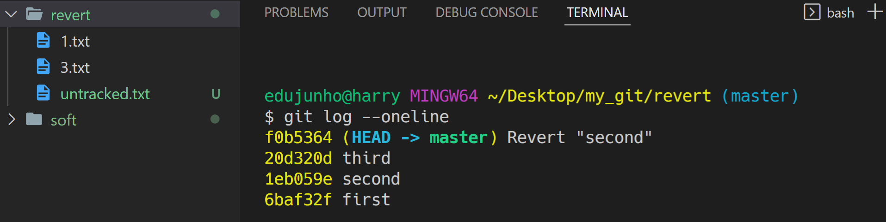
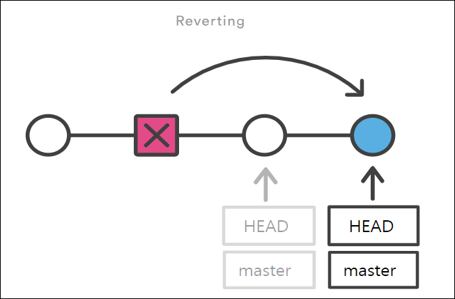

[toc]

# Reset & Revert

> 공통점
>
> - '과거로 되돌린다.'  
>
> 차이점
>
> - '과거로 되돌리겠다는 내용도 기록되는가 (== commit 이력에 남는가)’


## 1. git reset

> 가끔 앱을 사용하다가 업데이트를 했는데, 오히려 예전 버전이 더 좋다고 느낄 때가 있습니다. 
>
> 이처럼 만약 여러분들이 예전 버전으로 돌아가고 싶을 땐 어떻게 해야할까요?


**명령어**

```bash
$ git reset [옵션] <커밋 ID>
```

- **시계를 마치 과거로 돌리는 듯한 행위**로써, 특정 커밋 상태로 되돌아갑니다.
- 특정 커밋으로 되돌아 갔을 때, 해당 커밋 이후로 쌓아 놨던 커밋들은 전부 사라집니다.


**옵션**

- `옵션`은 아래와 같이 세 종류가 있으며, 생략 시 `--mixed`가 기본 값입니다.

  1. `--soft`

     - **돌아가려는 커밋으로 되돌아가고**,
     - 이후의 commit된 파일들을 `staging area`로 돌려놓음 (commit 하기 전 상태)
     - 즉, 다시 커밋할 수 있는 상태가 됨

  2. `--mixed`

     - **돌아가려는 커밋으로 되돌아가고**,
     - 이후의 commit된 파일들을 `working directory`로 돌려놓음 (add 하기 전 상태)
     - 즉, unstage 된 상태로 남아있음
     - 기본 값

  3. `--hard`

     - **돌아가려는 커밋으로 되돌아가고**,
     - 이후의 commit된 파일들(`tracked 파일들`)은 모두 working directory에서 삭제
     - 단, Untracked 파일은 그대로 Untracked로 남음


### 옵션별 결과

> 돌아가려는 커밋(first) 이후에 커밋된 `2.txt`, `3.txt`가 어떻게 처리되는지 확인하기

- 시작 전 커밋 확인

  ```bash
  $ git log --oneline
  20d320d (HEAD -> master) third
  1eb059e second
  6baf32f first
  ```

1. `--soft`

   ```bash
   $ git reset --soft 6baf
   ```

   

2. `--mixed`

   ```bash
   $ git reset 6baf
   ```

   

3. `--hard`

   ```bash
   $ git reset --hard 6baf
   ```

   


- 옵션 한눈에 보기
  


- 그림으로 이해하는 `git reset`

  

> 이전 커밋으로 돌아가고, 돌아간 커밋 이후의 내역은 사라집니다.


> **[참고사항]**
>
> 혹시나 이미 삭제한 커밋으로 다시 돌아가고 싶다면? → `git reflog`를 사용합니다.
>
> ```bash
> $ git reflog
> 1a410ef HEAD@{0}: reset: moving to 1a410ef
> ab1afef HEAD@{1}: commit: modified repo.rb a bit
> 484a592 HEAD@{2}: commit: added repo.rb
> 
> $ git reset --hard <복구하고자 하는 커밋ID>
> 
> # git reflog 명령어는 HEAD가 이전에 가리켰던 모든 커밋을 보여줍니다.
> # 따라서 --hard 옵션을 통해 지워진 커밋도, reflog로 조회하여 돌아갈 수 있습니다.
> ```


---


## 2. git revert

> `git reset`은 쉽게 과거로 돌아갈 수 있다는 장점이 있지만, 커밋 내역이 사라진다는 단점이 있습니다. 
>
> 따라서 다른 사람과 협업할 때 커밋 내역의 차이로 인해 충돌이 발생할 수 있습니다.


**명령어**

```bash
$ git revert <커밋 ID>
```

- **특정 사건을 없었던 일로 만드는 행위**로써, `이전 커밋을 취소한다는 새로운 커밋`을 만듭니다.
- `git reset`은 커밋 내역을 삭제하는 반면, `git revert`는 새로 커밋을 쌓는다는 차이가 있습니다.


**사용 예시**

- 시작 전 커밋 확인

  ```bash
  $ git log --oneline
  20d320d third
  1eb059e second
  6baf32f first
  ```

- second 커밋으로 revert

  ```bash
  $ git revert 1eb059
  ```

- vim 편집기가 나오면 저장 후 종료

  ```bash
  $ git log --oneline
  f0b5364 (HEAD -> master) Revert "second" # 새로 쌓인 커밋
  20d320d third
  1eb059e second # 히스토리는 남아있음
  6baf32f first
  ```

- second 커밋에서 있었던 `2.txt`가 사라진 것을 확인(second 커밋을 없었던 일로 만든 것)

  


- 그림으로 이해하는 `git revert`

  

> 이전 커밋을 취소했다는 새로운 커밋을 생성합니다. (이전 커밋은 그대로 살아있습니다.)


> **[중요]**
>
> `git reset`과 비슷하다는 이유로 다음 사항이 혼동될 수 있습니다. 
>
> - `git reset --hard 5sd2f42`라고 작성하면 5sd2f42라는 커밋`으로` 돌아간다는 뜻입니다.
>
> - `git revert 5sd2f42`라고 작성하면 5sd2f42라는 커밋`을` 되돌린다는 뜻입니다.


> **[참고사항]**
>
> ```bash
> # 공백을 통해 여러 커밋을 한꺼번에 되돌리기 가능
> $ git revert 7f6c24c 006dc87 3551584
> 
> # 범위 지정을 통해 여러 커밋을 한꺼번에 되돌리기 가능
> $ git revert 3551584..7f6c24c
> 
> # 커밋 메시지 작성을 위한 편집기를 열지 않음 (자동으로 커밋 완료)
> $ git revert --no-edit 7f6c24c
> 
> # 자동으로 커밋하지 않고, Staging Area에만 올림 (이후, git commit으로 수동 커밋)
> # 이 옵션은 여러 커밋을 revert 할 때 하나의 커밋으로 묶는게 가능
> $ git revert --no-commit 7f6c24c
> ```