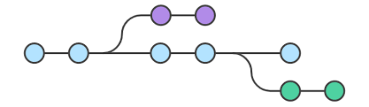
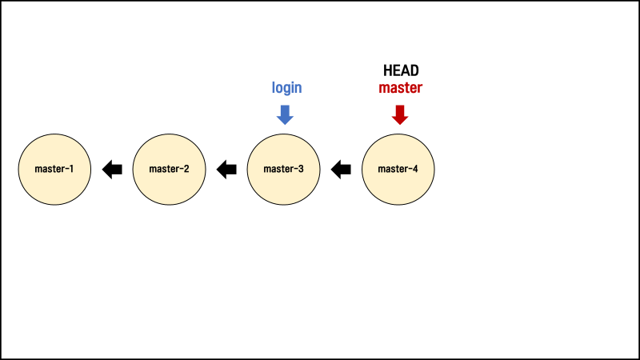
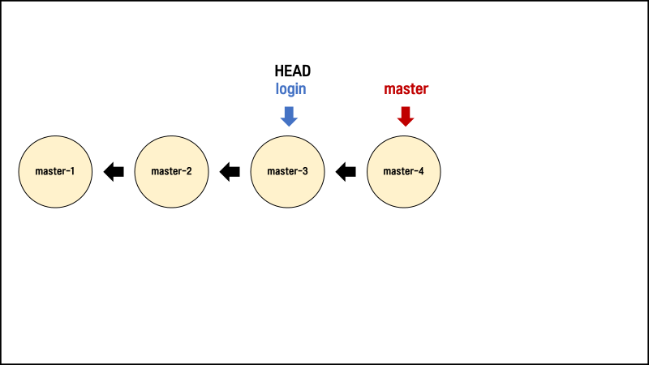
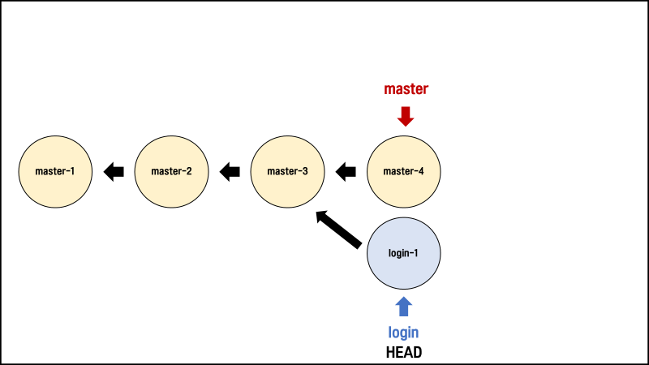

[toc]

---

## Branch

> Git에서 Branch라는 개념은 매우 중요합니다. 
>
> 사실상 버전 관리의 꽃이라고 할 수 있습니다.
>
> https://git-scm.com/book/en/v2/Git-Branching-Branches-in-a-Nutshell



- 나뭇가지처럼 여러 갈래로 작업 공간을 나누어 독립적으로 작업할 수 있도록 도와주는 Git의 도구
  - 개발을 하다 보면 코드를 여러 개로 복사해야 하는 일이 자주 생기는데, 코드를 통째로 복사하고 나서 원래 코드와는 상관없이 독립적으로 개발을 진행할 수 있도록 도움


**장점**

1. 독립 공간을 형성하기 때문에 원본(master)에 대해 안전
2. 하나의 작업은 하나의 브랜치로 나누어 진행되므로 체계적인 개발이 가능
3. 특히나 Git의 브랜치는 매우 가벼우며 순식간에 브랜치를 새로 만들고 브랜치 사이를 이동할 수 있음


**브랜치를 꼭 써야할까?**

1. 일단 master 브랜치는 상용을 의미합니다. 그래서 언제든 세상에 공개되어 있습니다.
2. 만약 상용에 에러가 있어서 고쳐야 한다면 어떻게 해야할까요?
3. 고객들이 사용하고 있는데, 함부로 버전을 되돌리거나 삭제할 수 있을까요?
4. 따라서 브랜치를 통해 별도의 작업 공간을 만들고, 그곳에서 되돌리거나 삭제를 합니다.
5. 브랜치는 완전하게 독립이 되어있어서 어떤 작업을 해도 master에는 영향을 끼치지 못하죠.
6. 그리고 이후에 에러를 해결했다면? 그 내용을 master에 반영할 수도 있습니다!
7. 이러한 이유 때문에 Git에서 브랜치는 정말 강력한 기능 중의 하나라고 할 수 있습니다.

<br>

---

<br>

### Branch command

#### git branch

> 브랜치 조회, 생성, 삭제 등 브랜치와 관련된 Git 명령어

```bash
# 브랜치 목록 확인
$ git branch

# 원격 저장소의 브랜치 목록 확인
$ git branch -r

# 새로운 브랜치 생성
$ git branch <브랜치 이름>

# 특정 브랜치 삭제
$ git branch -d <브랜치 이름> # 병합된 브랜치만 삭제 가능
$ git branch -D <브랜치 이름> # (주의) 강제 삭제 (병합되지 않은 브랜치도 삭제 가능)
```

<br>

#### git switch

> “Switch branches” 
>
> - 현재 브랜치에서 다른 브랜치로 `HEAD`를 이동시키는 명령어 
> - `HEAD`란 현재 브랜치를 가리키는 포인터를 의미합니다.
> - 2019년 8월 git 2.23 버전에서 출시
>
> https://git-scm.com/docs/git-switch
>
> [https](https://github.blog/2019-08-16-highlights-from-git-2-23/)[://github.blog/2019-08-16-highlights-from-git-2-23/](https://github.blog/2019-08-16-highlights-from-git-2-23/)

```bash
# 다른 브랜치로 이동
$ git switch <다른 브랜치 이름>

# 브랜치를 새로 생성과 동시에 이동
$ git switch -c <브랜치 이름>
```


**git switch 주의사항**

> “git switch 하기 전에, 워킹 디렉토리 파일이 모두 버전 관리가 되고 있나요?

1. master 브랜치와 feature 브랜치가 있다고 가정해보자
2. feature 브랜치에서 test.txt를 만들고 git add 하지 않은 상태에서 
   git switch master를 하면 어떤 일이 발생할까?
3. 바로 feature 브랜치에서 만들었던 test.txt가 master 브랜치에도 똑같이 생성됨

- **“왜 그럴까?”**

1. Git의 브랜치는 독립적인 작업 공간을 가지지만, 어디까지나 Git이 관리하는 파일 트리에 한해서임
2. git add를 하지 않은, 즉 Staging Area에 한 번도 올라가지 않은 새 파일은 
   Git의 버전 관리를 받고 있지 않기 때문에 브랜치가 바뀌더라도 계속 유지되는 것
3. 따라서 반드시 git switch를 하기 전에는 모든 워킹 디렉토리의 파일이 버전 관리가 되고 있는지 확인해야 함


---


## Branch scenario

> git branch와 git switch를 통해 브랜치를 조회, 생성, 이동하는 실습을 진행

### (1) 사전 세팅

1. 홈 디렉토리에 git-branch-practice 폴더를 생성하고 이동 후 vscode를 엽니다.

   ```bash
   $ mkdir git-branch-practice
   $ cd git-branch-practice
   $ code .
   ```

2. Git 저장소를 생성합니다.

   ```bash
   $ git init
   Initialized empty Git repository in C:/Users/kyle/git-branch-practice/.git/
   ```

3. test.txt를 생성하고 각각 master-1, master-2, master-3 이라는 내용을 순서대로 입력하여 커밋 3개를 작성합니다.

   ```bash
   $ touch test.txt
   
   # test.txt에 master-1 작성
   $ git add .
   $ git commit -m "master-1"
   
   # test.txt에 master-2 작성
   $ git add .
   $ git commit -m "master-2"
   
   # test.txt에 master-3 작성
   $ git add .
   $ git commit -m "master-3"
   ```

4. `git log --oneline`을 입력했을 때 아래와 같이 나와야 정상입니다.
   총 3개의 버전이 master 브랜치에 만들어졌습니다.

   ```bash
   $ git log --oneline
   0604dcd (HEAD -> master) master-3
   9c22c89 master-2
   3d71510 master-1
   ```

5. 현재 모습

   


### (2) 브랜치 생성 및 조회

1. 현재 위치(master 브랜치의 최신 커밋)에서 login이라는 이름으로 브랜치를 생성합니다.

   ```bash
   $ git branch login
   ```

2. login브랜치가 잘 생성되었는지 확인합니다.
   `* master`의 의미는 현재 HEAD가 가리키는 브랜치는 `master`라는 것입니다.

   ```bash
   $ git branch
     login
   * master
   ```

3. `git log --oneline`을 입력했을 때 아래와 같이 나와야 정상입니다.
   `0604dcd` 커밋 기준으로 `master`와 `login`브랜치가 위치한 것을 볼 수 있습니다.

   ```bash
   $ git log --oneline
   0604dcd (HEAD -> master, login) master-3
   9c22c89 master-2
   3d71510 master-1
   ```

4. `master` 브랜치에서 1개의 커밋을 더 작성합니다.

   ```bash
   # test.txt에 master-4 작성
   $ git add .
   $ git commit -m "master-4"
   ```

5. 현재 브랜치와 커밋의 상태 확인

   ```bash
   $ git log --oneline
   5ca7701 (HEAD -> master) master-4
   0604dcd (login) master-3
   9c22c89 master-2
   3d71510 master-1
   ```

6. 현재까지 결과

   


### (3) 브랜치 이동

1. 현재 브랜치와 커밋의 상태는 다음과 같습니다.

   ```bash
   $ git log --oneline
   5ca7701 (HEAD -> master) master-4
   0604dcd (login) master-3
   9c22c89 master-2
   3d71510 master-1
   ```

2. 이때 login브랜치로 이동하면 어떤 일이 일어날까요?

   ```bash
   $ git switch login
   ```

3. master 브랜치의 test.txt에 작성한 master-4가 지워졌습니다!

   ```bash
   # login 브랜치의 test.txt 모습
   
   master-1
   master-2
   master-3
   ```

4. 그리고 `git log --oneline`을 입력하면 아래와 같이 나타납니다.
   이제 `HEAD`는 `login` 브랜치를 가리키고, `master` 브랜치가 보이지 않습니다.

   ```bash
   $ git log --oneline
   0604dcd (HEAD -> login) master-3
   9c22c89 master-2
   3d71510 master-1
   ```

5. master 브랜치는 삭제된 걸까요?
   아닙니다! 브랜치를 조회 해보면 다음과 같이 나타납니다.
   HEAD가 `login` 브랜치를 가리키면서, log도 `login` 브랜치 기준으로 보이는 것이었습니다.

   ```bash
   $ git branch
   * login
     master
   ```

6. `git log --oneline --all`을 입력하면 모든 브랜치의 로그를 볼 수 있습니다.

   ```bash
   $ git log --oneline --all
   5ca7701 (master) master-4
   0604dcd (HEAD -> login) master-3
   9c22c89 master-2
   3d71510 master-1
   ```

7. 현재까지 결과

   

> 즉, 브랜치를 이동한다는건 HEAD가 해당 브랜치를 가리킨다는 것을 의미하고, 
>
> 브랜치는 최신 커밋을 가리키므로, HEAD가 해당 브랜치의 최신 커밋을 가리키게 됩니다. 
>
> 따라서 워킹 디렉토리의 내용도 HEAD가 가리키는 브랜치의 최신 커밋 상태로 변화합니다.


### (4) login 브랜치에서 커밋 생성

1. test.txt 파일에 login-1이라고 작성합니다.

   ```bash
   # login 브랜치의 test.txt
   master-1
   master-2
   master-3
   login-1
   ```

2. 추가적으로 test_login.txt도 생성하고 login-1이라고 작성해봅시다.

   ```bash
   $ touch test_login.txt
   
   # 이후 test_login.txt에 작성
   login-1
   ```

3. 커밋을 생성합니다.

   ```bash
   $ git add .
   $ git commit -m "login-1"
   ```

4. `git log --oneline --all --graph`를 통해 아래와 같은 내용을 확인합니다.
   `master` 브랜치와 `login` 브랜치가 다른 갈래로 갈라진 것을 확인할 수 있습니다.

   ```bash
   $ git log --oneline --graph --all
   * 3b0a091 (HEAD -> login) login-1
   | * 5ca7701 (master) master-4
   |/
   * 0604dcd master-3
   * 9c22c89 master-2
   * 3d71510 master-1
   ```

5. 현재까지 결과

   


