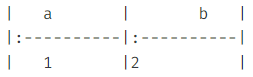

# 마크다운 문법

기본적인 마크다운 사용법에 대해 정리해보려고 한다.

마크다운은 텍스트 기반의 마크업 언어로 쉽게 쓰고 읽을 수 있으며 HTML로 변환이 가능하다. 특수기호와 문자를 이용한 매우 간단한 구조의 문법을 사용하여 웹에서도 보다 빠르게 컨텐츠를 작성하고 직관적으로 인식할 수 있다. 내가 사용하고 있는 블로그, 특히 깃허브의 README.md 파일 등 여러 곳에서 사용되고 있고 간단하게 기록하고 가독성을 높일 수 있는 강점을 가지고 있다. 

## 헤더
헤더는 # 기호를 통해서 h1 ~ h6까지 표현 가능하다.

>
# 헤더1
## 헤더 2
### 헤더 3
#### 헤더 4
##### 헤더 5
###### 헤더 6

## 목록
목록은 크게 순서가 있는 목록과 순서가 없는 목록으로 구분할 수 있다. 

### 순서가 없는 목록 (unordered list)
- 목록은 `*`나 `-`을 통해서 작성 가능하다.
- `tab` 을 이용하면 하위 목록으로 전환 가능하다.
- 목록 1
  - 목록 1-1

### 순서가 있는 목록 (ordered list)
`1.` 으로 목록을 구성한다.
1. 파이썬
2. 자바
3. 자바 스크립트

## 코드 블록
 코드 블록은 ```을 통해 사용가능하고 각 언어를 뒤에 작성해주면 그 언어를 적용시켜준다. 

```python
print('hello world')
for i in range(5):
    print(i)
```

## 링크
 링크는 [넣고 싶은 링크](링크의 주소) 형식을 통해 작성 가능하다.

[구글링크](https://www.google.co.kr/)

## 인용문 (quote)
> 지금 보이는게 인용문이다!

## 표
표 같은 경우, 아래와 같이 구조를 잡아주어야 한다. 



| a    | b    |
| :--- | :--- |
| 1    | 2    |

## 이미지
이미지는 이와 같은 형태로 `` 작성하면 된다.


## 기타

*기울임(이탤릭체)*

**굵게(볼드체)**

***취소선***


## 이모지

### 웃는 얼굴 및 사람
😀😁😂🤣😃😄😅😆😉😊😋😎😍😘🥰😗😙😚☺🙂🤗🤩🤔🤨😐😑😶🙄😏😣😥😮🤐😯😪😫😴😌😛😜😝🤤😒😓😔😕🙃🤑😲☹🙁😖😞😟😤😢😭😦😧😨😩🤯😬😰😱🥵🥶😳🤪😵😡😠🤬😷🤒🤕🤢🤮🤧😇🤠🥳🥴🥺🤥🤫🤭🧐🤓😈👿🤡👹👺💀☠👻👽👾🤖💩😺😸😹😻😼😽🙀😿😾🙈🙉🙊👶🧒👦👧🧑👱👨👱‍♂🧔👩👱‍♀🧓👴👵👨‍⚕👩‍⚕👨‍🎓👩‍🎓👨‍🏫👩‍🏫👨‍⚖👩‍⚖👨‍🌾👩‍🌾👨‍🍳👩‍🍳👨‍🔧👩‍🔧👨‍🏭👩‍🏭👨‍💼👩‍💼👨‍🔬👩‍🔬👨‍💻👩‍💻👨‍🎤👩‍🎤👨‍🎨👩‍🎨👨‍✈👩‍✈👨‍🚀👩‍🚀👨‍🚒👩‍🚒👮👮‍♂👮‍♀🕵🕵‍♂🕵‍♀💂💂‍♂💂‍♀👷👷‍♂👷‍♀🤴👸👳👳‍♂👳‍♀👲🧕🤵👰🤰🤱👼🎅🤶🦸🦸‍♀🦸‍♂🦹🦹‍♀🦹‍♂🧙🧙‍♀🧙‍♂🧚🧚‍♀🧚‍♂🧛🧛‍♀🧛‍♂🧜🧜‍♀🧜‍♂🧝🧝‍♀🧝‍♂🧞🧞‍♀🧞‍♂🧟🧟‍♀🧟‍♂🙍🙍‍♂🙍‍♀🙎🙎‍♂🙎‍♀🙅🙅‍♂🙅‍♀🙆🙆‍♂🙆‍♀💁💁‍♂💁‍♀🙋🙋‍♂🙋‍♀🙇🙇‍♂🙇‍♀🤦🤦‍♂🤦‍♀🤷🤷‍♂🤷‍♀💆💆‍♂💆‍♀💇💇‍♂💇‍♀🚶🚶‍♂🚶‍♀🏃🏃‍♂🏃‍♀💃🕺👯👯‍♂👯‍♀🧖🧖‍♀🧖‍♂🧗🧗‍♀🧗‍♂🧘🧘‍♀🧘‍♂🛀🛌🕴🗣👤👥🤺🏇⛷🏂🏌🏌‍♂🏌‍♀🏄🏄‍♂🏄‍♀🚣🚣‍♂🚣‍♀🏊🏊‍♂🏊‍♀⛹⛹‍♂⛹‍♀🏋🏋‍♂🏋‍♀🚴🚴‍♂🚴‍♀🚵🚵‍♂🚵‍♀🏎 🏍🤸🤸‍♂🤸‍♀🤼🤼‍♂🤼‍♀🤽🤽‍♂🤽‍♀🤾🤾‍♂🤾‍♀🤹🤹‍♂🤹‍♀👫👬👭


### 손모양 및 하트
💏💑👪🤳💪🦵🦶👈👉☝👆🖕👇✌🤞🖖🤘🤙🖐✋👌👍👎✊👊🤛🤜🤚👋🤟✍👏👐🙌🤲🙏🤝💅👂👃👣👀👁👁‍🗨🧠🦴🦷👅👄🦰🦱🦳🦲💋💘💝💖💗💓💞💕💌❣💔❤🧡💛💚💙💜🖤💟💤💢💣💥💦💨💫💬🗨🗯💭🕳👓🕶🥽🥼👔👕👖🧣🧤🧥🧦👗👘👙👚👛👜👝🛍🎒👞👟🥾🥿👠👡👢👑👒🎩🎓🧢⛑📿💄💍💎

### 동식물
🐵🐒🦍🐶🐕🐩🐺🦊🦝🐱🐈🦁🐯🐅🐆🐴🐎🦄🦓🦌🐮🐂🐃🐄🐷🐖🐗🐽🐏🐑🐐🐪🐫🦙🦒🐘🦏🦛🐭🐁🐀🐹🐰🐇🐿🦔🦇🐻🐨🐼🦘🦡🐾🦃🐔🐓🐣🐤🐥🐦🐧🕊🦅🦆🦢🦉🦚🦜🐸🐊🐢🦎🐍🐲🐉🦕🦖🐳🐋🐬🐟🐠🐡🦈🐙🐚🦀🦞🦐🦑🐌🦋🐛🐜🐝🐞🦗🕷🕸🦂🦟🦠💐🌸💮🏵🌹🥀🌺🌻🌼🌷🌱🌲🌳🌴🌵🌾🌿☘🍀🍁🍂🍃

### 식음료
🍇🍈🍉🍊🍋🍌🍍🥭🍎🍏🍐🍑🍒🍓🥝🍅🥥🥑🍆🥔🥕🌽🌶🥒🥬🥦🍄🥜🌰🍞🥐🥖🥨🥯🥞🧀
🍖🍗🥩🥓🍔🍟🍕🌭🥪🌮🌯🥙🥚🍳🥘🍲🥣🥗🍿🧂🥫🍱🍘🍙🍚🍛🍜🍝🍠🍢🍣🍤🍥🥮🍡🥟🥠🥡🍦🍧🍨🍩🍪🎂🍰🧁🥧🍫🍬🍭🍮🍯🍼🥛☕🍵🍶🍾🍷🍸🍹🍺🍻🥂🥃🥤🥢🍽🍴🥄🔪🏺

### 개체
🌍🌎🌏🌐🗺🗾🧭🏔⛰🌋🗻🏕🏖🏜🏝🏞🏟🏛🏗🧱🏘🏚🏠🏡🏢🏣🏤🏥🏦🏨🏩🏪🏫🏬🏭🏯🏰💒🗼🗽⛪🕌🕍⛩🕋⛲⛺🌁🌃🏙🌄🌅🌆🌇🌉♨🌌🎠🎡🎢💈🎪🚂🚃🚄🚅🚆🚇🚈🚉🚊🚝🚞🚋🚌🚍🚎🚐🚑🚒🚓🚔🚕🚖🚗🚘🚙🚚🚛🚜🚲🛴🛹🛵🚏🛣🛤🛢⛽🚨🚥🚦🛑🚧⚓⛵🛶🚤🛳⛴🛥🚢✈🛩🛫🛬💺🚁🚟🚠🚡🛰🚀🛸🛎🧳⌛⏳⌚⏰⏱⏲🕰🕛🕧🕐🕜🕑🕝🕒🕞🕓🕟🕔🕠🕕🕡🕖🕢🕗🕣🕘🕤🕙🕥🕚🕦🌑🌒🌓🌔🌕🌖🌗🌘🌙🌚🌛🌜🌡☀🌝🌞⭐🌟🌠☁⛅⛈🌤🌥🌦🌧🌨🌩🌪🌫🌬🌀🌈🌂☂☔⛱⚡❄☃⛄☄🔥💧🌊🎃🎄🎆🎇🧨✨🎈🎉🎊🎋🎍🎎🎏🎐🎑🧧🎀🎁🎗🎟🎫🎖🏆🏅🥇🥈🥉⚽⚾🥎🏀🏐🏈🏉🎾🥏🎳🏏🏑🏒🥍🏓🏸🥊🥋🥅⛳⛸🎣🎽🎿🛷🥌🎯🎱🔮🧿🎮🕹🎰🎲🧩🧸♠♥♦♣♟🃏🀄🎴🎭🖼🎨🧵🧶🔇🔈🔉🔊📢📣📯🔔🔕🎼🎵🎶🎙🎚🎛🎤🎧📻🎷🎸🎹🎺🎻🥁📱📲☎📞📟📠🔋🔌💻🖥🖨⌨🖱🖲💽💾💿📀🧮🎥🎞📽🎬📺📷📸📹📼🔍🔎🕯💡🔦🏮

### 책, 연필
📔📕📖📗📘📙📚📓📒📃📜📄📰🗞📑🔖🏷💰💴💵💶💷💸💳🧾💹💱💲✉📧📨📩📤📥📦📫📪📬📭📮🗳✏✒🖋🖊🖌🖍📝💼📁📂🗂📅📆🗒🗓📇📈📉📊📋📌📍📎🖇📏📐✂🗃🗄🗑🔒🔓🔏🔐🔑🗝🔨⛏⚒🛠🗡⚔🔫🏹🛡🔧🔩⚙🗜⚖🔗⛓🧰🧲⚗🧪🧫🧬🔬🔭📡💉💊🚪🛏🛋🚽🚿🛁🧴🧷🧹🧺🧻🧼🧽🧯🛒🚬⚰⚱🗿

### 기호
🏧🚮🚰♿🚹🚺🚻🚼🚾🛂🛃🛄🛅⚠🚸⛔🚫🚳🚭🚯🚱🚷📵🔞☢☣⬆↗➡↘⬇↙⬅↖↕↔↩↪⤴⤵🔃🔄🔙🔚🔛🔜🔝🛐⚛🕉✡☸☯✝☦☪☮🕎🔯♈♉♊♋♌♍♎♏♐♑♒♓⛎🔀🔁🔂▶⏩⏭⏯◀⏪⏮🔼⏫🔽⏬⏸⏹⏺⏏🎦🔅🔆📶📳📴♀♂⚕♾♻⚜🔱📛🔰⭕✅☑✔✖❌❎➕➖➗➰➿〽✳✴❇‼⁉❓❔❕❗〰©®™💯🔠🔡🔢🔣🔤🅰🆎🅱🆑🆒🆓ℹ🆔Ⓜ🆕🆖🅾🆗🅿🆘🆙🆚🈁🈂🈷🈶🈯🉐🈹🈚🈲🉑🈸🈴🈳㊗㊙🈵🔴🔵⚪⚫⬜⬛◼◻◽◾▫▪🔶🔷🔸🔹🔺🔻💠🔘🔲🔳🏁🚩🎌🏴🏳🏳‍🌈🏴‍☠


👉 [출처](https://kali-live.tistory.com/22)
