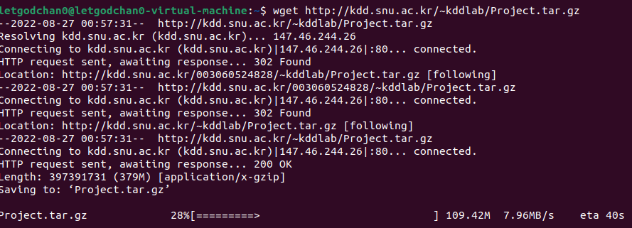

### 병렬 분산 알고리즘

- Scale-out : 아주 많은 값싼 서버들을 이용함
- Scale-up : 적은 수의 값비싼 서버들을 이용함
- 데이터 중심(data-intensive) 어플리케이션 분야에서는 아주 많은 값싼 서버들을 많이 이용하는 것을 선호함
- 고가의 서버들은 가격에 관점에서는 선형으로 성능이 증가하지 않음
  - 두 배의 성능의 프로세서 한 개를 가진 컴퓨터의 가격이 일반적인 프로세서 한 개를 가진 컴퓨터 가격의 두 배보다 훨씬 더 비쌈

<br>

### Why MapReduce

- 데이터 중심 프로세싱 (Data-intensive processing)
  - 한 대의 컴퓨터의 능력으로 처리가 어려움
  - 근본적으로 수 십대, 수 백대 혹은 수 천대의 컴퓨터를 묶어서 처리해야 함
  - 맵리듀스 프레임 워크가 하는 것이 바로 이것!!
- 맵리듀스는 빅데이터를 이용한 효율적인 계산이 가능한 첫 번째 프로그래밍 모델
  - 기존에 존재하는 여러 가지 다른 병렬 컴퓨팅 방법에서는 프로그래머가 낮은 레벨의 시스템 세부 내용까지 아주 잘 알고 많은 시간을 쏟아야만 함

<br>

### MapReduce Framework

- 값싼 컴퓨터들을 모아서 클러스터를 만들고 여기에서 빅데이터를 처리하기 위한 스케일러블(scalable) 병렬 소프트웨어의 구현을 쉽게 할 수 있도록 도와주는 간단한 프로그래밍 모델
  - `scalable`하다 라는 말은 사용자 수가 급증하거나 데이터가 급증해도 프로그램이 멈추거나 성능이 크게 떨어지는 일이 없다는 뜻
- 구글의 맵리듀스 또는 오픈소스인 하둡은 맵리듀스 프레임워크의 우수한 구현의 형태임
- 드라이버에 해당하는 메인 함수가 맵(map) 함수와 리듀스(reduce)함수를 호출해서 처리

<br>

### MapReduce Programming Model

- 함수형 프로그래밍 언어의 형태
- 유저는 아래 3가지 함수를 구현해서 제공해야 함
  - Main 함수 
  - Map 함수 : (key1, val1) -> [(key2, val2)]
  - Reduce 함수 : (key2, [val2]) -> [(key3, val3)]

<br>

### 맵리듀스 프레임워크

- 맵리듀스 프레임워크에서는 각각의 레코드(record) 또는 튜플(tuple)은 키-밸류 (KEY, VALUE) 쌍으로 표현된다.
- 맵리듀스 프레임워크는 메인(main) 함수를 한 개의 마스터 머신에서 수행하는데, 이 머신은 맵 함수를 수행하기 전에 전처리를 하거나, 리듀스 함수의 결과를 후처리 하는데 사용될 수 있다.
- 컴퓨팅은 맵(map)과 리듀스(reduce)라는 유저가 정의한 함수 한 쌍으로 이루어진 맵리듀스 페이즈(phase)를 한번 수행하거나 여러 번 반복해서 수행할 수 있다.
- 한번의 맵리듀스 페이즈는 맵 함수를 먼저 호출하고, 그 다음에 리듀스 함수를 호출하는데 때에 따라서는 맵 함수가 끝난 후에 컴바인(combine) 함수를 중간에 수행할 수 있다.
- 드라이버에 해당하는 메인(main) 프로그램에서 맵 리듀스 페이즈를 수행시킨다. 

<br>

### MapReduce Phase (3 단계로 수행)

- 맵(Map) 페이즈
  - 제일 먼저 수행되며 데이터의 여러 파티션(partition)에 병렬 분산으로 호출되어 수행된다.
  - 각 머신마다 수행된 Mapper는 맵 함수가 입력 데이터의 한 줄 마다 맵(Map) 함수를 호출한다.
  - Map 함수는 (KEY, VALUE)쌍 형태로 결과를 출력하고 여러 머신에 나누어 보내며 같은 KEY를 가진 (KEY, VALUE) 쌍은 같은 머신으로 보내진다. 
- 셔플링(shuffling) 페이즈
  - 모든 머신에서 맵 페이즈가 다 끝나면 시작된다.
  - 맵 페이즈에서 각각의 머신으로 보내진 (KEY, VALUE) 쌍을 KEY를 이용해서 정렬(Sorting)을 한 후에 각각의 KEY 마다 같은 KEY를 가진 (KEY, VALUE) 쌍을 모아서 밸류-리스트(VALUE-LIST)를 만든 다음에 (KEY, VALUE-LIST) 형태로 KEY에 따라서 여러 머신에 분산해서 보낸다.

- 리듀스(Reduce) 페이즈
  - 모든 머신에서 셔플링 페이즈가 다 끝나면 각 머신마다 리듀스 페이즈가 시작된다.
  - 각각의 머신에서는 셔플링 페이즈에서 해당 머신으로 보내진 각각의 (KEY, VALUE-LIST) 쌍 마다 리듀스 함수가 호출되며 하나의 리듀스 함수가 끝나면 다음 (KEY, VALUE-LIST) 쌍 에 리듀스 함수가 호출된다.
  - 출력이 있다면 (KEY, VALUE) 쌍 형태로 출력한다.

<br>

### Hadoop

- Apache 프로젝트의 맵리듀스 프레임워크의 오픈 소스
- 하둡 분산 파일 시스템(HDFS - Hadoop Distributed File System)
  - 빅 데이터 파일을 여러 대의 컴퓨터에 나누어서 저장함
  - 각 파일은 여러 개의 순차적인 블록을 저장함
  - 하나의 파일의 각각의 블록은 폴트 톨러런스(fault tolerance)를 위해서 여러 개로 복사되어 여러 머신의 여기저기 저장됨
    - 폴트 톨러런스는 시스템을 구성하는 부품의 일부에서 결함 또는 고장이 발생하여도 정상적, 혹은 부분적으로 기능을 수행할 수 있는 것을 말함
- 빅 데이터를 수천 대의 값싼 컴퓨터에 병렬 처리하기 위해 분산함

- 주요 구성 요소들
  - MapReduce - 소프트웨어의 수행을 분산함
  - Hadoop Distributed File System (HDFS) - 데이터를 분산함
- 한 개의 Namenode (master) 와 여러 개의 Datanode (slaves)
  - Namenode - 파일 시스템을 관리하고 클라이언트가 파일에 접근할 수 있게 함
  - Datanode - 컴퓨터에 들어있는 데이터를 접근할 수 있게 함
- 자바 프로그래밍 언어로 맵리듀스 알고리즘 구현

<br>

### MapReduce의 함수

- 맵 함수
  - org.apache.hadoop.mapreduce라는 패키지에 있는 Mapper 클래스를 상속받아서 맵 메소드(method)를 수정한다.
  - 입력 텍스트 파일에서 라인 단위로 호출되고 입력은 키-밸류(KEY, VALUE-LIST)의 형태
  - KEY는 입력 텍스트 파일에서 맨 앞 문자(character)를 기준으로 맵 함수가 호출된 해당 라인의 첫 번째 문자까지의 오프셋(offset)
  - VALUE는 텍스트의 해당 라인 전체가 들어있다.
- 리듀스 함수
  - org.apache.hadoop.mapreduce라는 패키지에 있는 Reducer 클래스를 상속받아서 reduce 메소드를 수정한다.
  - 셔플링 페이즈의 출력을 입력으로 받는데 키-밸류의 형태
  - VALUE-LIST는 맵 함수의 출력에서 KEY를 갖는 (KEY, VALUE) 쌍들의 VALUE들의 리스트
- 컴바인 함수
  - 리듀스 함수와 유사한 함수인데 각 머신에서 맵 페이즈에서 맵 함수의 출력 크기를 줄여서 셔플링 페이즈와 리듀스 페이즈의 비용을 줄여주는데 사용된다.

<br>

### Combine 함수

- Map 함수의 결과 크기를 줄여준다.
- 각각의 머신에서 Reduce 함수를 이용하는 것처럼 수행된다.
- 셔플링 비용을 줄여준다
- 따라서 맵리듀스 알고리즘 디자인에서 사용하는 것이 좋다.

<br>

### Overview of MapReduce

-  Mapper and Reducer
  - 각 머신에서 독립적으로 수행된다.
  - Mapper는 Map 함수를 Reducer는 Reduce 함수를 각각 수행한다.
- Combine functions
  - 각 머신에서 Map 함수가 끝난 다음에 Reduce 함수가 하는 일을 부분적으로 수행한다.
  - 셔플링 비용과 네트웍 트래픽(Network Traffic)을 감소 시킨다.
- Mapper와 Reducer는 필요하다면 setup() and cleanup()를 수행할 수 있다.
  - setup() : 첫 Map 함수나 Reduce 함수가 호출되기 전에 맨 먼저 수행한다.
    - 모든 Map 함수들에게 Broadcast해서 전달해야 할 파라미터 정보를 Main 함수에서 받아오는데 사용
    - 모든 Map 함수들이 공유하는 자료구조를 초기화 하는데 사용
  - cleanup() : 마지막 Map 함수나 Reduce 함수가 끝나고 나면 수행한다.
    - 모든 Map 함수들이 공유하는 자료구조의 결과를 출력하는데 사용
- 한 개의 MapReduce job을 수행할 때에 Map 페이즈만 수행하고 중단 할 수도 있다. 

<br>

### 하둡 설치

- VM ware ubuntu 환경 내에서 (Ctrl + Alt + t)로 터미널 켜기
- 패키징된 파일 다운로드

```bash
$ wget http://kdd.snu.ac.kr/~kddlab/Project.tar.gz
```



- 설치

```bash
$ tar zxf Project.tar.gz
$ sudo chown -R hadoop:hadoop Project
$ cd Project
$ sudo mv hadoop-3.2.2 /usr/local/hadoop
$ sudo apt update
$ sudo apt install ssh openjdk-8-jdk ant -y
$ ./set_hadoop_env.sh
$ source ~/.bashrc
```

<br>

### 하둡 실행을 위한 준비

- Hadoop 계정으로 실행

  - Root 계정에 있다면 Ctrl + d

- Empty 'ssh key' generation

  - $ ssh-keygen -t rsa -P ""
    - 저장할 파일을 물어보면 default로 enter만 친다.
  - `$ cat $Home/.ssh/id_rsa.pub >> $Home/.ssh/authorized_keys `
  - 제대로 생성되었는지 확인
    - -$ ssh localhost
    - 질문이 뜨면 yes를 입력하고
    - 그 다음 비밀번호를 물어보지 않고 prompt가 뜨면 성공

  

