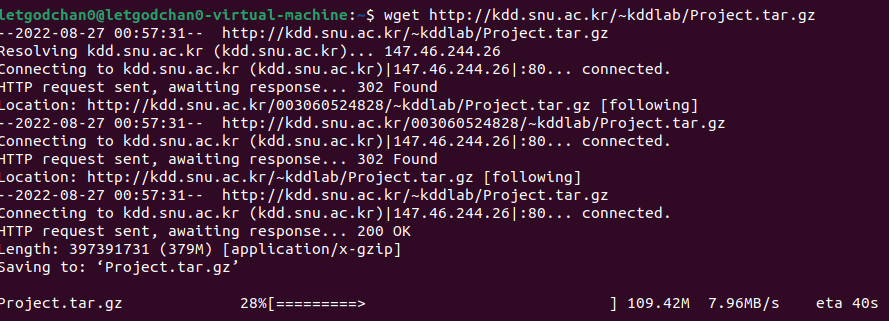

### 병렬 분산 알고리즘

- Scale-out : 아주 많은 값싼 서버들을 이용함
- Scale-up : 적은 수의 값비싼 서버들을 이용함
- 데이터 중심(data-intensive) 어플리케이션 분야에서는 아주 많은 값싼 서버들을 많이 이용하는 것을 선호함
- 고가의 서버들은 가격에 관점에서는 선형으로 성능이 증가하지 않음
  - 두 배의 성능의 프로세서 한 개를 가진 컴퓨터의 가격이 일반적인 프로세서 한 개를 가진 컴퓨터 가격의 두 배보다 훨씬 더 비쌈

<br>

### Why MapReduce

- 데이터 중심 프로세싱 (Data-intensive processing)
  - 한 대의 컴퓨터의 능력으로 처리가 어려움
  - 근본적으로 수 십대, 수 백대 혹은 수 천대의 컴퓨터를 묶어서 처리해야 함
  - 맵리듀스 프레임 워크가 하는 것이 바로 이것!!
- 맵리듀스는 빅데이터를 이용한 효율적인 계산이 가능한 첫 번째 프로그래밍 모델
  - 기존에 존재하는 여러 가지 다른 병렬 컴퓨팅 방법에서는 프로그래머가 낮은 레벨의 시스템 세부 내용까지 아주 잘 알고 많은 시간을 쏟아야만 함

<br>

### MapReduce Framework

- 값싼 컴퓨터들을 모아서 클러스터를 만들고 여기에서 빅데이터를 처리하기 위한 스케일러블(scalable) 병렬 소프트웨어의 구현을 쉽게 할 수 있도록 도와주는 간단한 프로그래밍 모델
  - `scalable`하다 라는 말은 사용자 수가 급증하거나 데이터가 급증해도 프로그램이 멈추거나 성능이 크게 떨어지는 일이 없다는 뜻
- 구글의 맵리듀스 또는 오픈소스인 하둡은 맵리듀스 프레임워크의 우수한 구현의 형태임
- 드라이버에 해당하는 메인 함수가 맵(map) 함수와 리듀스(reduce)함수를 호출해서 처리

<br>

### MapReduce Programming Model

- 함수형 프로그래밍 언어의 형태
- 유저는 아래 3가지 함수를 구현해서 제공해야 함
  - Main 함수 
  - Map 함수 : (key1, val1) -> [(key2, val2)]
  - Reduce 함수 : (key2, [val2]) -> [(key3, val3)]

<br>

### 맵리듀스 프레임워크

- 맵리듀스 프레임워크에서는 각각의 레코드(record) 또는 튜플(tuple)은 키-밸류 (KEY, VALUE) 쌍으로 표현된다.
- 맵리듀스 프레임워크는 메인(main) 함수를 한 개의 마스터 머신에서 수행하는데, 이 머신은 맵 함수를 수행하기 전에 전처리를 하거나, 리듀스 함수의 결과를 후처리 하는데 사용될 수 있다.
- 컴퓨팅은 맵(map)과 리듀스(reduce)라는 유저가 정의한 함수 한 쌍으로 이루어진 맵리듀스 페이즈(phase)를 한번 수행하거나 여러 번 반복해서 수행할 수 있다.
- 한번의 맵리듀스 페이즈는 맵 함수를 먼저 호출하고, 그 다음에 리듀스 함수를 호출하는데 때에 따라서는 맵 함수가 끝난 후에 컴바인(combine) 함수를 중간에 수행할 수 있다.
- 드라이버에 해당하는 메인(main) 프로그램에서 맵 리듀스 페이즈를 수행시킨다. 

<br>

### MapReduce Phase (3 단계로 수행)

- 맵(Map) 페이즈
  - 제일 먼저 수행되며 데이터의 여러 파티션(partition)에 병렬 분산으로 호출되어 수행된다.
  - 각 머신마다 수행된 Mapper는 맵 함수가 입력 데이터의 한 줄 마다 맵(Map) 함수를 호출한다.
  - Map 함수는 (KEY, VALUE)쌍 형태로 결과를 출력하고 여러 머신에 나누어 보내며 같은 KEY를 가진 (KEY, VALUE) 쌍은 같은 머신으로 보내진다. 
- 셔플링(shuffling) 페이즈
  - 모든 머신에서 맵 페이즈가 다 끝나면 시작된다.
  - 맵 페이즈에서 각각의 머신으로 보내진 (KEY, VALUE) 쌍을 KEY를 이용해서 정렬(Sorting)을 한 후에 각각의 KEY 마다 같은 KEY를 가진 (KEY, VALUE) 쌍을 모아서 밸류-리스트(VALUE-LIST)를 만든 다음에 (KEY, VALUE-LIST) 형태로 KEY에 따라서 여러 머신에 분산해서 보낸다.

- 리듀스(Reduce) 페이즈
  - 모든 머신에서 셔플링 페이즈가 다 끝나면 각 머신마다 리듀스 페이즈가 시작된다.
  - 각각의 머신에서는 셔플링 페이즈에서 해당 머신으로 보내진 각각의 (KEY, VALUE-LIST) 쌍 마다 리듀스 함수가 호출되며 하나의 리듀스 함수가 끝나면 다음 (KEY, VALUE-LIST) 쌍 에 리듀스 함수가 호출된다.
  - 출력이 있다면 (KEY, VALUE) 쌍 형태로 출력한다.

<br>

### Hadoop

- Apache 프로젝트의 맵리듀스 프레임워크의 오픈 소스
- 하둡 분산 파일 시스템(HDFS - Hadoop Distributed File System)
  - 빅 데이터 파일을 여러 대의 컴퓨터에 나누어서 저장함
  - 각 파일은 여러 개의 순차적인 블록을 저장함
  - 하나의 파일의 각각의 블록은 폴트 톨러런스(fault tolerance)를 위해서 여러 개로 복사되어 여러 머신의 여기저기 저장됨
    - 폴트 톨러런스는 시스템을 구성하는 부품의 일부에서 결함 또는 고장이 발생하여도 정상적, 혹은 부분적으로 기능을 수행할 수 있는 것을 말함
- 빅 데이터를 수천 대의 값싼 컴퓨터에 병렬 처리하기 위해 분산함

- 주요 구성 요소들
  - MapReduce - 소프트웨어의 수행을 분산함
  - Hadoop Distributed File System (HDFS) - 데이터를 분산함
- 한 개의 Namenode (master) 와 여러 개의 Datanode (slaves)
  - Namenode - 파일 시스템을 관리하고 클라이언트가 파일에 접근할 수 있게 함
  - Datanode - 컴퓨터에 들어있는 데이터를 접근할 수 있게 함
- 자바 프로그래밍 언어로 맵리듀스 알고리즘 구현

<br>

### MapReduce의 함수

- 맵 함수
  - org.apache.hadoop.mapreduce라는 패키지에 있는 Mapper 클래스를 상속받아서 맵 메소드(method)를 수정한다.
  - 입력 텍스트 파일에서 라인 단위로 호출되고 입력은 키-밸류(KEY, VALUE-LIST)의 형태
  - KEY는 입력 텍스트 파일에서 맨 앞 문자(character)를 기준으로 맵 함수가 호출된 해당 라인의 첫 번째 문자까지의 오프셋(offset)
  - VALUE는 텍스트의 해당 라인 전체가 들어있다.
- 리듀스 함수
  - org.apache.hadoop.mapreduce라는 패키지에 있는 Reducer 클래스를 상속받아서 reduce 메소드를 수정한다.
  - 셔플링 페이즈의 출력을 입력으로 받는데 키-밸류의 형태
  - VALUE-LIST는 맵 함수의 출력에서 KEY를 갖는 (KEY, VALUE) 쌍들의 VALUE들의 리스트
- 컴바인 함수
  - 리듀스 함수와 유사한 함수인데 각 머신에서 맵 페이즈에서 맵 함수의 출력 크기를 줄여서 셔플링 페이즈와 리듀스 페이즈의 비용을 줄여주는데 사용된다.

<br>

### Combine 함수

- Map 함수의 결과 크기를 줄여준다.
- 각각의 머신에서 Reduce 함수를 이용하는 것처럼 수행된다.
- 셔플링 비용을 줄여준다
- 따라서 맵리듀스 알고리즘 디자인에서 사용하는 것이 좋다.

<br>

### Overview of MapReduce

-  Mapper and Reducer
  - 각 머신에서 독립적으로 수행된다.
  - Mapper는 Map 함수를 Reducer는 Reduce 함수를 각각 수행한다.
- Combine functions
  - 각 머신에서 Map 함수가 끝난 다음에 Reduce 함수가 하는 일을 부분적으로 수행한다.
  - 셔플링 비용과 네트웍 트래픽(Network Traffic)을 감소 시킨다.
- Mapper와 Reducer는 필요하다면 setup() and cleanup()를 수행할 수 있다.
  - setup() : 첫 Map 함수나 Reduce 함수가 호출되기 전에 맨 먼저 수행한다.
    - 모든 Map 함수들에게 Broadcast해서 전달해야 할 파라미터 정보를 Main 함수에서 받아오는데 사용
    - 모든 Map 함수들이 공유하는 자료구조를 초기화 하는데 사용
  - cleanup() : 마지막 Map 함수나 Reduce 함수가 끝나고 나면 수행한다.
    - 모든 Map 함수들이 공유하는 자료구조의 결과를 출력하는데 사용
- 한 개의 MapReduce job을 수행할 때에 Map 페이즈만 수행하고 중단 할 수도 있다. 

<br>

### (1) 하둡 설치

- VM ware ubuntu 환경 내에서 (Ctrl + Alt + t)로 터미널 켜기
- 패키징된 파일 다운로드

```bash
$ wget http://kdd.snu.ac.kr/~kddlab/Project.tar.gz
```



- 설치

```bash
$ tar zxf Project.tar.gz
$ sudo chown -R hadoop:hadoop Project
$ cd Project
$ sudo mv hadoop-3.2.2 /usr/local/hadoop
$ sudo apt update
$ sudo apt install ssh openjdk-8-jdk ant -y
$ ./set_hadoop_env.sh
$ source ~/.bashrc
```

<br>

### (2) 하둡 실행을 위한 준비

- Hadoop 계정으로 실행

  - Root 계정에 있다면 Ctrl + d

- Empty 'ssh key' generation

  - $ ssh-keygen -t rsa -P ""
    - 저장할 파일을 물어보면 default로 enter만 친다.
  - `$ cat $HOME/.ssh/id_rsa.pub >> $HOME/.ssh/authorized_keys `
  - 제대로 생성되었는지 확인
    - -$ ssh localhost
    - 질문이 뜨면 yes를 입력하고
    - 그 다음 비밀번호를 물어보지 않고 prompt가 뜨면 성공

- 모든 명령은 hadoop 계정에서 수행

  - Path를 지정하기 위해 `/home/hadoop` 에서 source .bashrc를 실행

- 네임노드(Name node) 포멧(format)

  - Disk의 포멧과 같은 개념
  - `$ hadoop namenode -format`

- Dfs daemon start

  - `$ start-dfs.sh`

- MapReduce daemon start (stanalone 모드에서는 불필요)

  - `$ start-mapred.sh`

- 맵리듀스 코드를 수행할 준비가 다 되었는지 확인

  - 수행중인 java 프로세스 리스트를 확인
  - `$jps`
    - NameNode
    - SecondaryNameNode
    - DataNode
    - TaskTracker (stanalone 모드에서는 불필요)
    - JobTracker (stanalone 모드에서는 불필요)

- 위 thread 들이 다 떠있으면 성공 (standalone 모드에서는 3개만 확인)

- hadoop 계정의 HDFS 상에 지금은 아무런 디렉토리나 파일이 없음!!

  - `$ hdfs dfs -ls`

- hadoop 계정의 HDFS 상에서 `/user` 디렉토리 안에 hadoop 디렉토리 생성

  - `$ hdfs dfs -mk dir /user/hadoop`

  

<br>

### (3) Hadoop에서 맵리듀스 코드 실행

- 데이터 생성은 Linux에서 하고 MapReduce 코드와 입력 데이터는 HDFS에 옮겨서 MapReduce 알고리즘을 수행
- Linux 디렉토리
  -  `src/` (맵리듀스 코드)
    - Driver.java (맵리듀스 코드 컴파일을 위한 파일)
    - Wordcount.java
  - `template/` (과제를 위한 템플릿)
  - `datagen/` (과제 데이터를 생성하기 위한 코드)
  - `data/` (과제를 위한 데이터)
  - `build.html` (맵리듀스 코드 컴파일을 위한 파일)
- Hadoop 디렉토리
  - `wordcount_test/` (맵리듀스 코드 실행을 위한 데이터 디렉토리)
  - `wordcount_test_out/` (맵리듀스 코드 실행 결과를 저장하는 디렉토리)
- Linux에서 유닉스 명령어
  - cd - 현재 디렉토리를 이동
  - ls - 디렉토리에 있는 파일과 서브 디렉토리를 출력
  - cat - 파일의 내용을 출력
  - cp - 파일을 복사
    - copy foo.txt abc/. (foo.txt 파일을 abc 라는 이름의 서브 디렉토리에 복사)
  - mkdir - 새로운 디렉토리 생성
- 하둡 파일 시스템에서 유닉스 명령어 사용
  - `hdfs dfs -mkdir foo` (하둡 파일 시스템에 foo라는 새로운 디렉토리를 생성)
  - `hdfs dfs -rm -r foo` (하둡의 파일 시스템이 있는 foo 라는 디렉토리를 삭제)
- 하둡에서 맵리듀스 자바 코드 실행 방법
  - `hadoop jar ssafy.jar wordcount wordcount_test wordcount_test_out`
  - hadoop jar [jar file] [program name] <input arguments ...>
- MapReduce 예제 코드 하둡에서 실행
  - hadoop 실습을 위한 소스가 Project/src에 위치
    - `$ cd ./Project/src`
  - Project/src/Driver.java 파일에 아래 내용이 들어 있어야 Wordcount 코드 수행 가능
    - `pgd.addClass("wordcount", Wordcount.class, "A map/reduce program that perform word counting. ");`
    - src 디렉토리에 있는 Driver.java 파일에 새로운 맵리듀스 코드를 만들 때마다 `pgd.addClass`로 만들어서 append 해야 함
    - Driver.java 파일이 바뀌면 반드시 Project 디렉토리에서 ant를 다시 수행해야 함
    - `pgd.addClaa("wordcount", Wordcount.class, " ")` 에서 맨 앞의 `""` 안에 있는 이름으로 수행시켜야 함

<br>

### 맵리듀스 코드 컴파일 하기

#### 1.  컴파일

```bash
$ cd Project
$ ant
```

- Unix의 make 같은 것
- `src` 디렉토리에 있는 것을 다 모아서 컴파일 한 후에 `ssafy.jar`를 생성
- Project 디렉토리에 있는 build.xml 파일에 정의한 대로 수행

<br>

#### 2. Wordcount MapReduce 알고리즘 코드 실행

```bash
$ cd /home/hadoop/Project/data
$ hdfs dfs -mkdir wordcount_test
$ hdfs dfs -put wordcount-data.txt wordcount_test
```

- 테스트 데이터를 hdfs에 copy

<br>

```bash
hdfs dfs -rm -r wordcount_test_out
```

- 반드시 `wordcount_test_out` 디렉토리를 삭제한 후에 실행 해야 함

<br>

```bash
$ hadoop jar ssafy.jar wordcount wordcount_test wordcount_test_out
$ hadoop jar [jar file] [program name] < input arguments ...>
```

- Hadoop 실행 방법

<br>

#### 3. 결과 확인 (reduce 함수를 2개 사용하면 아래와 같은 출력파일 2개가 생성)

```bash
$ hdfs dfs -cat wordcount_test_out/part-r-00000 | more
$ hdfs dfs -cat wordcount_test_out/part-r-00001 | more
```

<br>

#### 4. 새로운 맵리듀스 알고리즘 코드를 만든 다음에 컴파일을 하는 법

- 소스 코드 파일을 Project/src/ 디렉토리에 넣기

- Project/src 디렉토리에 있는 `Driver.java` 파일에 아래 라인을 추가하기

  - `pgd.addClass("program name", class name, "description");`

  ```java
  package ssafy;
  
  import org.apache.hadoop.utilProgramDriver;
  
  public class ExampleDriver {
      public static void main(String argv[]){
          int exitCode = -1;
          ProgramDriver pgd = new ProgramDriver();
          try {
              // 여기 아래 추가!!
              pgd.addClass("program name", class name, "A map/reduce program that counts the words in the input files.");
              pgd.driver(argv);
              
              //Success
              exitCode = 0;
          }
          catch(Throwable e){
              e.printStackTrace();
          }
          System.exit(exitCode);
      }
  }
  ```

- 컴파일 하려면 Project 디렉토리에서 ant를 수행

```bash
$ ant
```

<br>

### [참고]

> 맵리듀스의 입출력에 사용하는 타입들은 셔플링 페이즈에서 정렬하는데 필요한 비교 함수 등 여러 함수가 이미 정의되어 있다.

- 하둡의 맵리듀스의 맵 함수, 리듀스 함수, 컴바인 함수 등에서 입출력에 사용할 수 있는 클래스와 해당되는 자바 타입
  - Text : string
  - IntWritable : int
  - LongWritable : long
  - FloatWritable : float
  - DoubleWritable : double
- 만일 새로운 클래스를 정의해서 입출력에 사용하고 싶다면 필요한 여러 함수도 함께 정의를 같이 해야 한다!!

<br>

### Wordcount.java - Map 함수

```bash
$ vi Wordcount.java
```

```java
public class Worcount {
    public static class TokenizerMapper extends Mapper<Object, Text, Text, IntWritable>{
        
        private final static IntWritable one = new IntWritable(1);
        private Text word = new Text();
        
        public void map(Object key, Text value, Context context) throws IOException, InterruptedException {
            StringTokenizer itr = new StringTokenizer(value.toString());
            while (itr.hasMoreTokens()){
                word.set(itr.nexToken());
                context.write(word, one);
            }
        }
    }
}
```

- `Text, IntWritable, FloatWritable` 클래스는 하둡에서 이미 제공!
- Static class는 class A안의 class B를 자신의 상위 class A를 만들지 않고 B의 instance를 만들 수 있다.
- `<Map 함수 입력 KEY, 타입, Map 함수 입력 VALUE 타입, Map 함수 출력 KEY 타입, Map 함수 출력 VALUE 타입>`
- `StringTokenizer` - 스트링을 단어 단위로 자름, 하둡의 Text 타입인 value를 string 타입으로 바꾸어 줘야 StringTokenizer 함수를 호출하 수가 있어서 Text 타입의 `toString` 멤버 함수 사용

<br>

### Wordcount.java - Reduce 함수

```java
public static class IntSumReducer extends Reducer<Text, IntWritable, Text, IntWritable>{
    private IntWritable result = new IntWritable();
    
    public void reduce(Text key, Iterable<IntWritable> values, Context context) throws IOException, InterruptedException{
        int sum = 0;
        for (IntWritable val: values){
            sum += val.get();
        }
        result.set(sum);
        context.write(key, result);
    }
}
```

- `<Reduce함수 입력 KEY, 타입, Reduce함수 입력 VALUE 타입, Reduce함수 출력 KEY 타입, Reduce함수 출력 VALUE 타입>`

- `context.write(key, result);` : KEY-VALUE 쌍을 EMIT 함, KEY와 VALUE는 반드시 선언한 타입이어야 함

<BR>

### Wordcount.java 수정 후 실행

- Project 디렉토리에서 ant 수행

  ```bash
  $ hdfs dfs -rm -r wordcount_test_out (리듀스 함수 출력 디렉토리를 삭제 - 이미 디렉)
  ```

  - 리듀스 함수 출력 디렉토리를 삭제 - 이미 디렉토리가 있다면 삭제해야 함

  ```bash
  $ hdfs dfs -put data/wordcount-data.txt wordcount_test
  ```

  - 데이터 파일을 입력 디렉토리에 복사

  ```bash
  $ hadoop jar ssafy.jar wordcount .wordcount_test wordcount_test_out
  ```

  ```bash
  $ hdfs dfs -cat wordcount_test_out/part-r-0000 | more 
  ```

  - reducer를 2개 사용해서 결과 파일이 2개

  ```bash
  $ hdfs dfs -cat wordcount_test_out/part-r-0001 | more
  ```

  - reducer를 2개 사용해서 결과 파일이 2개

- 결과 파일들은 reducer 개수에 따라서 아래 이름으로 생성된다.

  - part-r-00000
  - part-r-00001
  - ...
  - part-r-(reducer 개수 - 1)

<br>

### 프로젝트 1

- Wordcount.java를 수정하여 각 단어의 첫 글자(알파벳) 만을 카운트하는 프로그램을 Wordcount1char.java 파일 이름으로 작성

- 필요한 함수

  - `substring(int startIdx, int endIdx)`
    - String class의 member method
    - String에서 startIdx에서 시작해 (endIdx-1)까지 문자로 이루어진 String을 리턴합니다.

- Wordcount.java 파일을 Wordcount1char.java 파일 이름으로 copy하고 수정한다.

- `Project/src/Driver.java` 파일 수정

  ```java
  pgd.addClass("wordcount1char", Wordcount1char.class, "A map/reduce program that counts the 1st character of words in the input files.");
  ```

- Project 디렉토리에서 해야할 것
  - `ant` 실행
  - `hdfs dfs -rm -f wordcount_test_out` (리듀스 함수의 결과를 출력하는 디렉토리를 삭제 - 이미 디렉토리가 있다면 삭제해야 함)
  - hadoop jar ssafy.jar wordcount1char wordcount_test wordcount_test_out
  - hdfs dfs -cat wordcount_test_out/part-r-00000 | more
  - hdfs dfs -cat wordcount_test_out/part-r-00001 | more
- Reduce 마다 결과가 만들어지기 때문에 모든 결과를 확인해야 한다!

<br>

### 프로젝트 2

- Wordcount.java를 변형하여 아래와 같은 일을 하도록 Wordcountsort.java 파일 이름으로 작성

  - reducer의 개수를 2개로 설정
  - Word의 첫 글자가 ASCII 코드 순서로 a보다 앞에 온느 경우 reducer 0으로 (즉, 결과가 part-r-00000에 찍히도록)
  - 나머지 (특수문자 등)는 reducer 2로 (part-r-00002)

- Project/src/Driver.java 파일 수정

  ```java
  pgd.addClass("wordcountsort", Wordcountsort, "A map/reduce program that output frequency of the words in the input files by alphabetical order.");
  ```

- 필요한 함수

  - `toString()`
    - String class의 member method
    - Hadoop의 Text 타입을 Java의 string 타입으로 변환
  - `charAt(0)`
    - String class의 member method
    - String에서 첫 번째 character를 리턴

- Partitioner 클래스

  - 셔플링 페이즈에서 출력된 (KEY, VALUE-LIST)를 KEY를 보고 어느 reducer로 보낼 것인지를 결정하는 class
  - IntWritable의 경우 reducer 개수로 나눈 나머지에 의해서 Text의 경우 0에서 (reducer 개수 - 1)까지의 값을 출력하는 hash function이 기본으로 내장되어 있다.
  - 만일 셔플링 페이즈에서 출력된 (KEY, VALUE-LIST)의 KEY는 IntWritable 클래스의 객체이고 VALUE-LIST는 Text 타입일 때, 두 개의 reducer를 사용하고 customize된 Partitioner를 사용하지 않고 기본으로 제공되는 Partitioner를 쓴다면 아래와 같은 결과를 얻게 된다.
    - Key가 IntWritable이므로 홀수와 짝수에 따라 다른 reducer에 보냄

- Wordcount.java 코드를 어떻게 수정할까?

  - 아래의 class를 Wordcount.java에 넣기

  ```java
  public static class MyPartitioner extends Partitioner<Text, IntWritable> {
      @Override
      public int getPartition(Text key, IntWritable value, int numPartitions){
          if (key.toString().charAt(0) <= 'Z') return 0;
          else return 1;
      }
  }
  ```

  - Main 함수에 다음을 추가!
    - `job.setPartitionerClass(MyPartitioner.class);`
  - Partitioner 클래스를 import 하기!
    - `import org.apache.hadoop.mapreduce.Partitioner;`

- 코드 수행하기

  - `ant` 실행
  - hdfs dfs -rm -r wordcount_test_out (리듀스 함수의 결과를 출력하는 디렉토리를 삭제 - 이미 디렉토리가 있다면 삭제해야 함!)
  - hadoop jar ssafy.jar wordcountsort wordcount_test wordcount_test_out
  - hdfs dfs -cat wordcount_test_out/part-r-00000 | more
  - hdfs dfs -cat wordcount_test_out/part-r-00001 | more

<br>

### 프로젝트 3

- 단어 빈도수 계산 알고리즘을 Wordcount.java를 수정하여 inverted index를 출력하는 MapReduce 알고리즘 구현
- 입력 파일
  - 일반 텍스트
- 출력 파일
  - 단어 : `<tab>wordcount-data.txt:position, wordcount-data.txt:position`
  - 예)
    - this : wordcount-data.txt: 13, wordcount-data.txt: 13
    - that : wordcount-data.txt: 23, wordcount-data.txt: 3
- 필요한 함수:
  - StringTokenizer: StringTokenizer(value.toString());
    - newStringTokenizer(value.toString(), "", ture);
    - // 단어 단위로 자르기
  - Long: ((LongWritable)key).get();
    - 파일에서 현재 라인의 시작 위치의 byte offset을 가져옴
    - import org.apache.hadoop.io.LongWritable 넣어야 함
  - filename+":"+p;
    - // 파일명과 현재 위치를 concatenate
  - token.length()
    - String 타입의 variable인 token의 lenght를 얻으려면 필요함
- Project 디렉토리
  - `ant` 실행
  - 여기서는 리듀스 함수의 결과를 출력하는 디렉토리를 맵리듀스 코드에서 자동적으로 삭제하도록 구현할 것이기 때문에 삭제하지 않는다.
  - haddop jar ssafy.jar inverted wordcount_test invertedindex_test_out
  - hdfs dfs -cat invertedindex_test_out/part-r-00000 | more
  - hdfs dfs -cat invertedindex_test_out/part-r-00001 | more
- Reduce 마다 결과가 만들어지기 때문에 모든 결과를 체크해야 함
